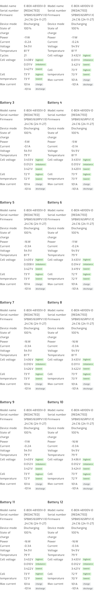

# 03 — Wiring the Pytes V5 stack

[Index](README.md) · Prev: [02 — Wiring the Sol-Ark](02-wiring-solark.md) · Next: [04 — SolarAssistant configuration](04-solarassistant-config.md)

This is the simpler half. One cable, one port, however many packs.

## The principle

The packs in a stack are already chained to one another, and the master pack aggregates
the whole stack. SolarAssistant plugs into the **master pack's RS232C console port**
and reads every pack through it — per-pack serial number, cell voltages, cell
imbalance, temperatures, and cycle count.

The [product page](https://solar-assistant.io/shop/products/pytes_rs232) states it
directly: *"A single cable can read all batteries in the battery bank."*

Do **not** add a second cable for the other packs, and do not tap the RS485 bus. The
console port is a separate interface from the RS485/CAN inter-pack link and from the
CAN link feeding the inverters — which is why it can be used without disturbing either.

**One cable per stack.** Order a second only for a second, electrically separate stack
with its own master.

## Step 1 — Identify the master pack

The master is the pack at the head of the chain — the one whose address is set to the
master position and from which the inverter CAN link originates. Address is set by the
DIP switches on the pack.

> Pytes has shipped several DIP-switch legends across V5 and E-Box revisions. Read the
> legend printed on your packs or the manual for your specific revision rather than
> copying a numbering scheme from another install. The requirements are the same in
> every revision: **one** master, and **unique** addresses on every pack in the stack.
> Address changes take effect only after the pack is restarted.
>
> On an already-commissioned bank that is communicating with the inverters, addressing
> is by definition already correct. Verify rather than adjust.

## Step 2 — Connect the console cable

Plug the [Pytes console USB cable](https://solar-assistant.io/shop/products/pytes_rs232)
into the master pack's port labelled **RS232C / console** and run it to the Raspberry
Pi.

Take care not to confuse the console port with the adjacent RS485 or CAN RJ45 sockets —
they are the same physical connector. The console port is the one labelled for
console/RS232C use; on most V5 and E-Box packs it is grouped with the display and
address controls rather than with the inter-pack link ports.

If the cable is in the wrong socket, nothing is damaged — SolarAssistant simply reports
the battery as disconnected.

## Step 3 — Confirm the CAN link to the inverters is untouched

The battery's CAN link to the inverters — the one landing on splitter pins 4–5 from
[02 — Wiring the Sol-Ark](02-wiring-solark.md) — is a different cable on a different
port and must be left in place. The console cable is additive.

After wiring, the stack has three distinct comms paths:

| Path | Carries | Endpoint |
|------|---------|----------|
| Inter-pack chain | Pack-to-pack aggregation | Between the packs |
| CAN to inverters | SOC, charge/discharge limits | Sol-Ark BMS port pins 4–5 |
| RS232C console | Full per-pack telemetry | SolarAssistant USB |

## What good looks like

Once configured, SolarAssistant enumerates the whole stack from the single cable.
Example from a twelve-pack site:

Total capacity resolves to the sum of the packs — here 1200 Ah from twelve 100 Ah packs
— and the protocol reports as `V2P`. Both are good evidence that the whole stack is
being read rather than just the master.

Per-pack detail confirms it pack by pack:

Each pack reports its own model, serial number, and firmware. Firmware should be
uniform across a stack; a pack on a different revision is worth noting even if it is
communicating.

---

Next: [04 — SolarAssistant configuration](04-solarassistant-config.md)
