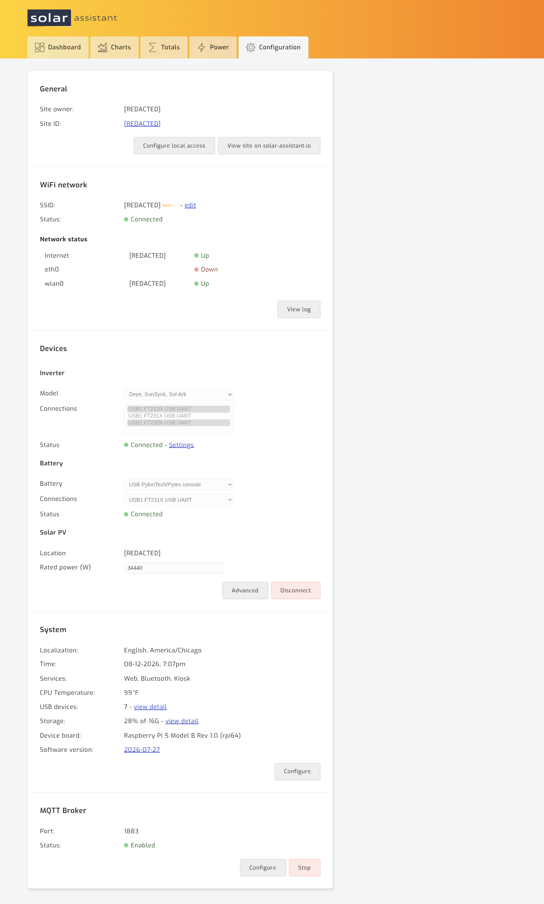
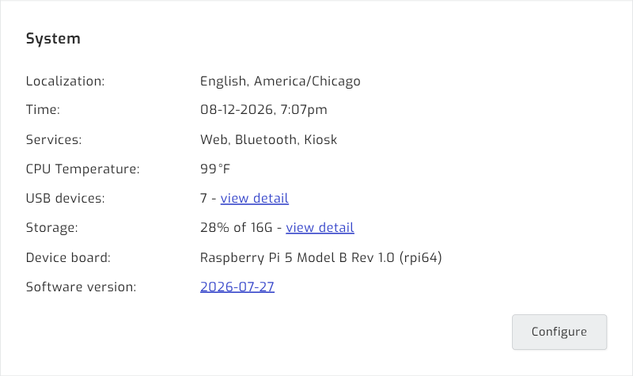
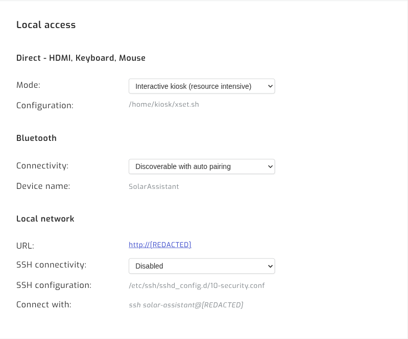

# 04 — SolarAssistant configuration

[Index](README.md) · Prev: [03 — Wiring the Pytes stack](03-wiring-pytes.md) · Next: [05 — Verification](05-verification.md)

With every adapter plugged into the Pi, the software side is short: pick two drivers
and assign the USB ports.

Open SolarAssistant on the LAN at the address shown on its console or in your DHCP
leases, or via its cloud proxy URL, and go to **Configuration**.

## Step 1 — Confirm the adapters enumerated

Before configuring anything, check that the Pi sees every cable.
**Configuration → System → USB devices → view detail**:

Expected, for a site with N inverters and M battery stacks:

| USB ID | Part | Count | Role |
|--------|------|-------|------|
| `0403:6001` | FT232 Serial (UART) | N | RS485 to each inverter |
| `0403:6015` | Bridge (I2C/SPI/UART/FIFO) | M | RS232 console to each stack's master |

The example above is a two-inverter, one-stack site: two FT232R and one FT231X. All
adapters should report as *Future Technology Devices International* — genuine FTDI, as
expected from the supplied cables.

If a cable is missing here, it is a cable, port, or power problem. Stop and fix it now;
no amount of configuration will help. On sites using a powered USB hub, confirm the hub
itself is enumerating.

## Step 2 — Unlock the configuration form

The Devices form is **read-only while the system is connected**. The dropdowns render
greyed out and cannot be changed until you press **Disconnect** at the bottom of the
Devices panel.

> On a running site, Disconnect stops data collection until you reconnect. Do it
> deliberately — during a maintenance window, not while you are chasing a live fault.
> You do not need to disconnect merely to *read* the current settings.

## Step 3 — Configure the inverters

In **Devices → Inverter**:

| Field | Value |
|-------|-------|
| Model | `Deye, SunSynk, Sol-Ark` |
| Connections | **one entry per inverter** |

Connections is a **multi-select list**, not a single-choice dropdown — this is the step
people miss. Highlight one FT232R entry for every inverter on site. Two Sol-Arks means
two highlighted entries; four means four.

Selecting fewer than you have silently monitors only some of the inverters, and the
dashboard still looks plausible because it shows site totals. Nothing warns you.

## Step 4 — Configure the battery

In **Devices → Battery**:

| Field | Value |
|-------|-------|
| Battery | `USB PylonTech/Pytes console` |
| Connections | the FT231X console adapter |

Battery Connections is a single-choice dropdown — correctly so, because one console
cable reads an entire stack. Pick the FT231X; the FT232R entries are inverter cables.

The driver is shared with PylonTech. `USB PylonTech/Pytes console` is the right choice
for Pytes V5 and E-Box hardware — there is no separate Pytes-only entry.

## Step 5 — Set PV rating

In **Devices → Solar PV**, set **Location** and **Rated power (W)** to the site's total
array rating across all inverters. This drives the expected-output overlay on the
dashboard charts; it does not affect data collection.

## The finished panel

In this two-inverter example, note that **USB0 and USB2 are both highlighted** in the
Connections list while USB1 is not — USB1 belongs to the battery. Both Inverter and
Battery show **Connected**.

Press **Connect** to resume collection if you disconnected in Step 2.

## Full configuration page for reference

*Example site. Site owner, hostname, IP addresses, WiFi SSID and location redacted.*

## System and access settings

Settings worth recording per site: localization and timezone, temperature unit, energy
totals reset period, scheduled reboot, and whether the MQTT broker is enabled.

Local access:

| Setting | Note |
|---------|------|
| Local URL | The LAN address to bookmark for on-site work |
| SSH | Disabled by default |
| Bluetooth | Discoverable with auto pairing by default |
| Remote proxy | Pick the region nearest the site |
| Cloud proxy | The public `*.solar-assistant.io` URL for the site |

> With SSH disabled there is no shell fallback for diagnostics, which is why
> [06 — Troubleshooting](06-troubleshooting.md) is written entirely against the web UI.
> If you want a shell for future debugging, enable SSH deliberately and key-only —
> don't leave it on password auth on a system reachable through a cloud proxy.

---

Next: [05 — Verification](05-verification.md)
