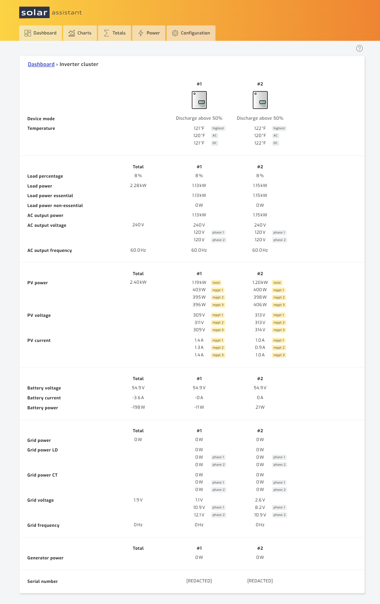
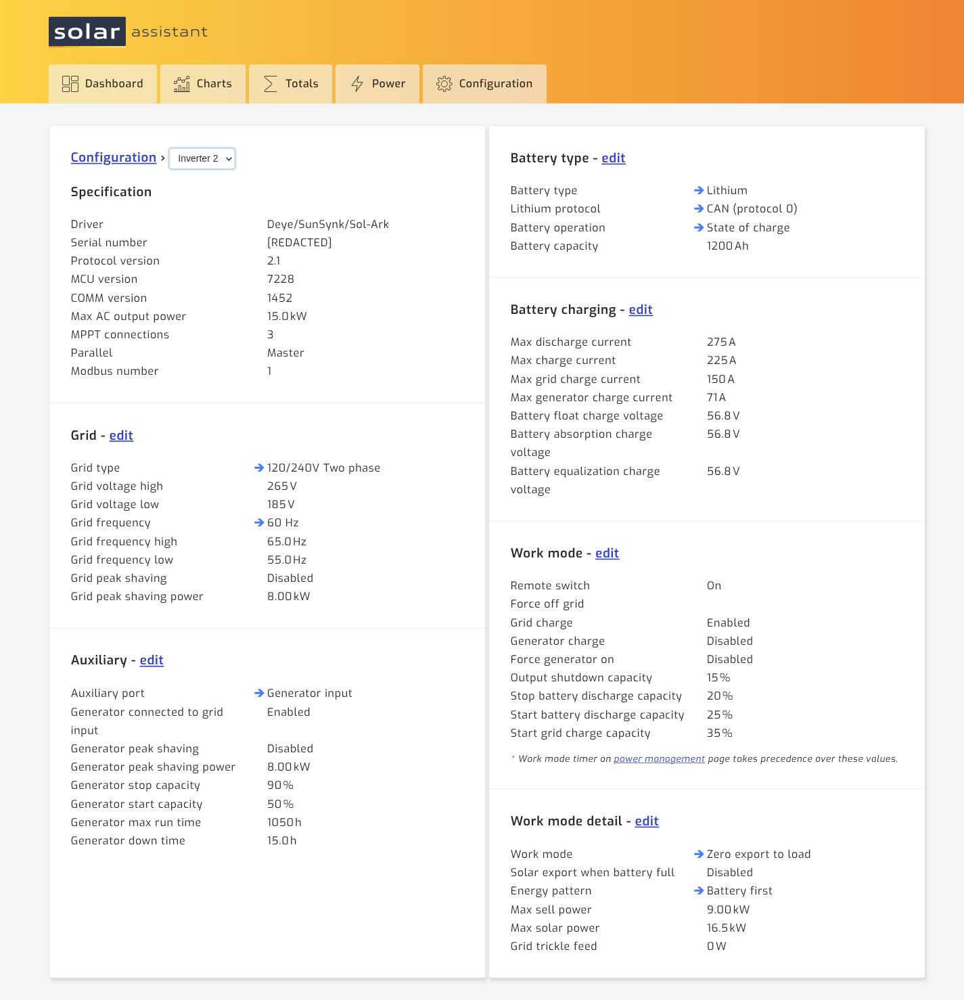

# 05 — Verification

[Index](README.md) · Prev: [04 — SolarAssistant configuration](04-solarassistant-config.md) · Next: [06 — Troubleshooting](06-troubleshooting.md)

"Connected" on the Configuration page is a weak signal. It goes green when *any*
selected port opens — it does not prove every inverter is being polled, and it does not
prove every pack is enumerating. Work through these four checks instead.

## Check 1 — Every inverter appears as its own column

**Dashboard → Inverter** (`/inverter/status`).

With more than one inverter the page is titled **Inverter cluster** and shows a numbered
column per unit beside the Total column. **Count the columns and match against the
number of inverters on site.** Fewer columns than inverters means some are not being
read — go back to
[Step 3 of page 04](04-solarassistant-config.md#step-3--configure-the-inverters) and
confirm every USB port is selected.

Then confirm at the bottom of the page that the **serial numbers are all different**.
Two columns showing the same serial means the same inverter is being read twice — a
cable is in the wrong inverter's splitter.

## Check 2 — Per-inverter values are independent and plausible

In the capture above, the two units report closely matched but **not identical**
figures: 1.13 kW and 1.15 kW load, 1.19 kW and 1.20 kW PV. That small divergence is the
proof of independent live reads. Columns showing byte-identical values across every row
are suspicious.

Each Sol-Ark 15K should report **3 MPPTs** and **15.0 kW** max AC output. A column
reporting different hardware characteristics than its siblings is either a different
model or a misidentified unit.

## Check 3 — Inverter settings are readable per unit

**Configuration → Inverter**, then use the breadcrumb dropdown to switch between
inverters. Every unit must load its own Specification block with its own serial number.

For each inverter, record:

| Field | Check |
|-------|-------|
| Driver | `Deye/SunSynk/Sol-Ark` |
| Serial number | Unique across the site |
| Parallel | Exactly one **Master** across all units |
| Modbus number | Unique across the site |
| Protocol / MCU / COMM | Should match across identical units |

**Exactly one unit must report Master.** Two masters, or none, is a parallel
configuration fault on the inverters themselves — not a SolarAssistant problem, and
worth resolving before trusting any of the data.

Confirm on every unit that `Lithium protocol` still reads **CAN (protocol 0)**. If a
unit has reverted to an RS485 battery protocol, its CAN pins are no longer in use and
the splitter arrangement from page 02 no longer holds for that inverter.

Expect the parallel roles and Modbus numbers **not** to line up with SolarAssistant's
own inverter numbering — see [00 — Overview](00-overview.md).

## Check 4 — Every battery pack enumerates

**Dashboard → Battery** (`/battery/status`).

| Signal | Expected |
|--------|----------|
| Capacity | packs × per-pack Ah |
| Pack cards | One per pack, numbered from 1 |
| Protocol version | Reported (e.g. `V2P`) |
| Serial numbers | All distinct |
| Firmware | Uniform across the stack |

Capacity is the fastest tell. Twelve 100 Ah packs must sum to 1200 Ah; anything lower
means packs are missing from the chain.

Cell imbalance is reported bank-wide and per pack. A pack with a substantially wider
spread than its neighbours is worth investigating on its own merits, independent of
comms.

## Recording a baseline

Capture these values once the system verifies good, and keep them with this document.
Most future comms faults present as a **change** from baseline rather than an outright
failure, and without a baseline the change is invisible:

- Every inverter serial, parallel role, and Modbus number
- Pack count, total capacity, and every pack serial
- The USB IDs and counts from `Configuration → System → USB devices`
- Typical cell imbalance range at 100% SOC

[07 — Worked example](07-worked-example.md) is a filled-in baseline for a real site and
can be used as a template.

---

Next: [06 — Troubleshooting](06-troubleshooting.md)
