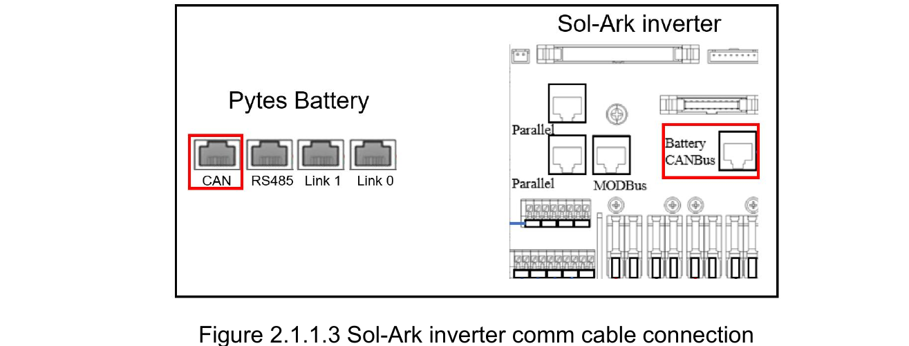
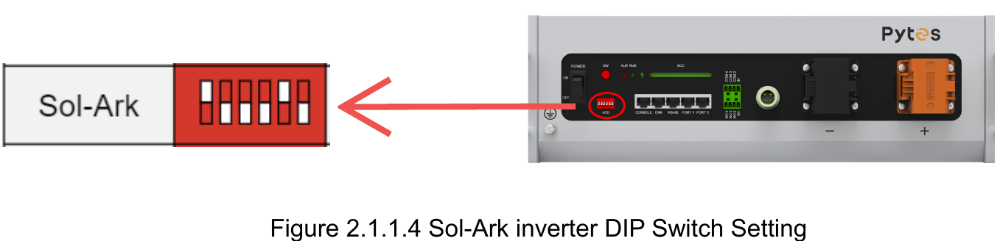
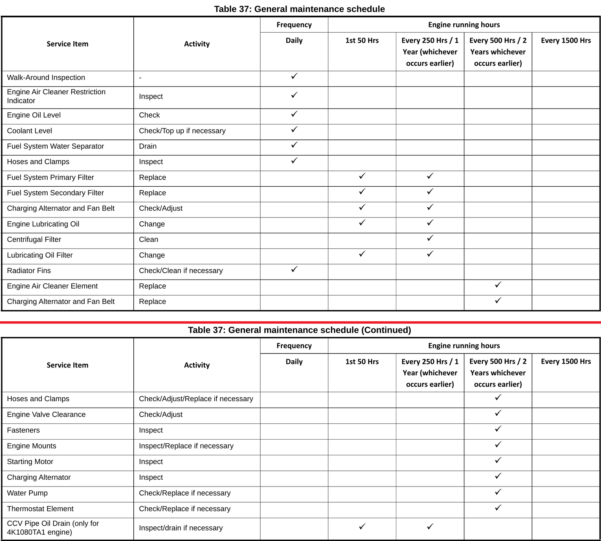
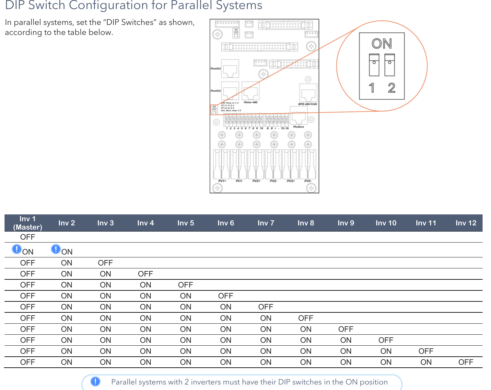
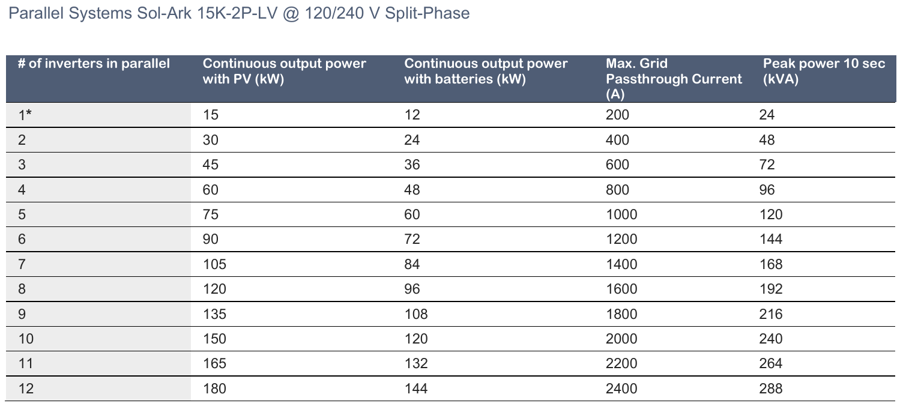

# Technician appendix — reference detail for the runbook

This appendix holds the technical reference material that backs each runbook page:
setpoint tables, fault-code tables, manual quotations, specifications, service parts and
the two procedures that are for a technician only. End users do not need it — every
runbook page stands alone. Sections are lettered to match the pointer at the end of each
runbook page.

| Section | Runbook page |
|---|---|
| **A** | Batteries — `cheatsheet-low-battery` |
| **B** | Generator — `cheatsheet-generator` |
| **C** | Inverter failed — `cheatsheet-inverter-failure` |
| **D** | Solar panels — `cheatsheet-array-maintenance` |
| **E** | Maintenance calendar — `cheatsheet-maintenance-calendar` |

---

## A. Batteries — technician reference

*Backs runbook page `cheatsheet-low-battery`.*

Sources: Sol-Ark *15K Installation Manual* MA-00007 Rev. 13 (§3.4 Battery Setup, §8.1
Error Codes), the *Pytes V5 User Manual* (§1 specifications, §5.4 start/shut down, §7
troubleshooting), the *Pytes Sol-Ark Guide for V5*, and the installer's customer-training
deck. For an LFP bank (Pytes V5) on parallel Sol-Ark 15K-2P inverters.

#### The one rule that voids the warranty

> *"The battery should be charged within 12 hours when it's fully discharged or
> over-discharging protection mode is activated. Fail to follow this instruction will
> damage the battery and is not covered by warranty."* — Pytes V5 manual, §Safety

#### Two safeties, in the order they trip

| Layer | What it does | Where set |
|---|---|---|
| **1. Sol-Ark `Shutdown` V/%** | Inverter stops AC output *"to protect the battery from an over discharge situation"*; battery icon turns red. Output resumes at **`Restart` V/%**. If grid or generator is available the inverter passes it through instead. | Battery Setup → Discharge |
| **2. BMS under-voltage protection** | The pack itself stops discharging (ALM **steady red**, other LEDs off). Pytes V5 enters this **below ~5 %** (installer) but keeps a reserve so it can be charged back. Per the manual, protection **releases automatically** once charge is applied — but only if that happens **within 12 hours**. | Fixed in the BMS; pack range 47.5–57.6 V |

Layer 1 is meant to fire first and leave headroom above layer 2. Between them sits
**`Low Batt`** (icon turns yellow): on an off-grid site TOU may discharge down to
*Shutdown*, on a grid-tied site only down to *Low Batt* (§4). The goal is never to reach
layer 2.

Self-clearing alarms (overload, under-voltage, low battery) auto-restart **up to 5
times**; after the fifth stop on the same alarm the inverter **locks out until manually
reset** and the cause is fixed (installer deck). **F56** DC_VoltLow_Fault: *"Batteries are
overly discharged, the inverter is Off-Grid and exceeded the programmed batt discharge
current by 20 %, or Lithium BMS has shut down."* F56 together with **F58** (BMS comms lost)
means the BMS has likely opened its contactor.

The Pytes manual is explicit that a blinking or even steady ALM *"does not necessarily
indicate a faulty battery"*, and that protection *"will resume normal operation
automatically once the 'protection' status is released."* On a pack whose LEDs do not
respond to POWER + SW: *"charge the battery correctly… if the battery enters into charging
mode, it should return to its normal state after completing the charging process."* *"Do
not repair the battery if no authorization from Pytes!"*

#### Recommended usable window (training deck)

- LFP: use down to **10–20 % SOC** in normal operation (80–90 % usable). The battery warranty excludes **routine discharge below 10 %**.
- Installer's off-grid setpoints: generator auto-start **35 %**, Sol-Ark Shutdown **15 %** (Sol-Ark's own default is 20 %), emergency floor **11 %**.
- During an outage the bank may go lower before Shutdown — acceptable occasionally, not routinely.
- Bring the bank to **100 % SOC at least once a week** for BMS balancing. Off-grid, that means a clear day with solar — the generator stops at ~95 % and will not do it.
- After any event that let the bank reach BMS protection, review whether the Sol-Ark `Shutdown` setpoint should be raised.

#### Setpoints to verify (Battery Setup → Discharge)

| Setting | Purpose | Sanity check |
|---|---|---|
| `Shutdown` % | Inverter stops output | Comfortably above the BMS protection point (~5 % on Pytes) — 15 % is the installer's value |
| `Restart` % | Output resumes | 5–10 points above Shutdown so it does not cycle |
| `Low Batt` % | Yellow warning; TOU floor on grid-tied | Between Shutdown and your normal daily floor |
| `Start %` (Gen Charge) | Generator auto-start | Above Low Batt, well above Shutdown — 35 % leaves ~20 points of reserve |
| Max Gen Runtime | Ends a run by time | Long enough to reach ~90 % from Start % at the set Amps |
| `BMS_Err_Stop` | Stop on loss of BMS comms | Know what it is set to — it decides what slaves do if the master (and its CAN cable) fails |
| Capacity (Ah/kWh) | Used for % SOC and limits | Matches the installed bank |
| Charge Efficiency / Batt Empty V | SOC calculation | Leave at manufacturer values; do not tune |
| `Use Batt % Charged`, `BMS Lithium Batt = 00`, `☑ Activate Battery` | Closed-loop Pytes comms | All three required by Pytes's Sol-Ark guide; Sol-Ark manual: Activate Battery *"MUST be selected … especially Lithium batteries."* A stale or missing battery display on the Sol-Ark means one is off or the CAN cable is out |
| Charge / discharge A (inverter side) | Per-pack limit × packs | Pytes V5: **75 A recommended, 100 A max** continuous per pack; derated outside 10–40 °C cell temperature; **no charging below 0 °C** |

#### Pytes V5 pack facts

51.2 V nominal, 100 Ah, **5.12 kWh** per pack; operating range 47.5–57.6 V. Charge 0–45 °C,
discharge −10–50 °C. Cycle life ≥6000 at 90 % DOD; calendar life ≥10 years.
Self-discharge 1–2 %/month. Master pack carries the DIP-switch address and the CAN cable
to the Sol-Ark (standard Ethernet cable; Sol-Ark *Battery CANBus* jack).

*Pytes Sol-Ark guide, Figures 2.1.1.3 and 2.1.1.4.*

**Bank power-up order (manual §5.4) — batteries before inverter, always**, to protect the
packs from the inverters' capacitor inrush: DC breakers on (if fitted) → all POWER buttons
ON → press the **master** pack's SW for 1 s → wait for every pack to show lights → only
then power the inverters (slaves first, master last). **Shut down:** hold the master SW
**3 s** → wait for all pack lights to go out → POWER buttons off → breakers off.

**Force charge (last resort):** isolate the pack (POWER off, breaker off if fitted) and
charge it alone at the terminals with a **51.2 V LFP force charger** until it wakes and
shows RUN steady, then return it to the bank. Never parallel a flat pack into live packs.
The installer's advice: own that charger before it is needed.

**Storage / long idle:** keep packs at 40–60 % SOC; if idle more than 6 months, charge to
>90 % every 6 months. A pack found at zero after storage: *"do not charge or use it
without permission, contact your installer."*

Set a SolarAssistant or Home Assistant alert a few points above `Low Batt` so the first
warning is a notification, not a yellow icon nobody is looking at.

---

## B. Generator — technician reference

*Backs runbook page `cheatsheet-generator`.*

Sources: Sol-Ark *15K Installation Manual* MA-00007 Rev. 13 (§2.5 Integrating a
Generator, §3.4 Battery Setup, §4 Operation Notes), the installer's customer-training deck
(as-delivered version), and the Wildcat Patriot / Hyundai *Operation and Maintenance
Manual* (20–100 kW mobile generating sets). Off-grid site: prime generator on the **GRID
input** with two-wire auto-start from the master's pins 7 & 8; separate 50 A inlet for a
portable generator on the **GEN input**.

#### How it behaves when left alone

| Rule | Source |
|---|---|
| Auto-start fires when the bank reaches **Start V or Start %** (one condition, not both) | §3.4 Gen Charge |
| Charging from the generator **stops at ~95 % SOC** — *"the batteries will charge until the battery bank accepts 5 % of its rated capacity in Amperes"*. It will **never** reach 100 % on generator power. | §4 note 6 |
| The 95 % ceiling is *"non-modifiable unless Time of Use is enabled and programmed"* | §4 note 6 |
| **If TOU is on**, the generator will not auto-start in any interval that does not have **☑ Charge** ticked, *"even if the Start V or Start % condition has been met"* | §2.5 |
| **Gen/Grid "A" is per inverter.** Multiply by the number of inverters for the current into the bank. | §2.5 |
| Off-grid: keep the **Gen A and Grid A values equal** *"to avoid logic issues"* | training deck |
| Max Gen Runtime (firmware 7228+, bottom of the Charge tab) and Gen Down Time can end or block a run regardless of SOC | training deck; §3.4 |
| Charge rate **tapers above 90 % SOC** (roughly 10 A per pack between 90 and 95 %). Size Max Gen Runtime to reach ~90 %, not 95 %. | training deck |
| Installer's off-grid setpoints: auto-start **35 %**, Sol-Ark shutdown **15 %**, Max Gen Runtime **150 min**. | training deck |
| Weekly exercise: **Monday 08:00, 20 min** by default. Disable with `00 \| 00 min`. Runs only if the DSE is in Auto. | §4 note 6; §3.4 |
| With a generator on the GRID input, **☑ GEN connect to Grid input** must be set, Grid Mode *General Standard*, Grid Reconnect Time 30 s | §3.4 Grid Charge; §4 note 5 |
| GEN terminal continuous limit **80 A** — do not exceed | §2.5 |
| Gen Force is a test function: *"The generator will not provide power during this test if grid power is available"*. Off-grid it runs **until unticked**; it does not stop at 95 %. | §3.4 |

#### Adjusting Start % on the fly

Start % is just a setting. On a clear-sky morning with the bank just above Start %,
lowering it a few points avoids a pointless run; raise it back afterwards. **Never
routinely below ~10 %** (LFP warranty). The installer's stated emergency floor is
**11 %**, and only if the generator will not start and the capacity is needed.

#### Fault matrix

| Symptom | Cause | Fix |
|---|---|---|
| Generator bogs / breaker trips shortly after qualifying | Charge current + loads exceed generator rating | Lower **Gen A** (per inverter). Shed heavy loads while charging. |
| Sol-Ark shows AC briefly then rejects it; **F60** Gen_Volt_or_Fre_Fault | Frequency or voltage outside limits — usually overload pulling it under 60 Hz | Lower Gen A; check governor; keep loads light until SOC recovers |
| Gen Signal on but nothing cranks | Two-wire loop open, DSE not in Auto, Start Failure latched, E-stop in | DSE to Auto; loop is on the **master's** pins 7 & 8 (N.O. dry contact); reset DSE |
| Gen Signal never comes on | TOU interval without ☑ Charge; Gen Down Time still counting; Max Gen Runtime hit | Check TOU intervals; check Gen Down Time; clear with Gen Force |
| Charging stops at ~95 % with generator running | Normal cutoff | Set an upper limit via TOU if it must stop sooner |
| Generator ran for hours, SOC barely moved | Gen A too low for the bank, or heavy loads | Raise Gen A within generator capacity; check load |

Rule of thumb for Gen A: generator continuous kW × 1000 ÷ ~55 V ÷ number of inverters,
then back off 10–20 % for loads and governor headroom. Portable: ~50 % of generator
capacity — e.g. 12 kW → ~6 kW → ~120 A DC total → **60 A per inverter** on two inverters.
~20 A × ~50 V ≈ 1 kW per inverter.

#### Generator — Wildcat Patriot 40 kW, DSE 6110 MKIII

**Ratings (single-phase 120/240 V):** 36 kW prime, **150 A** per leg, 50 kVA nameplate.
Derate 1.5 % per 10 °F above 77 °F. Fuel: **3.6 gal/h full load, 2.8 at 75 %, 2.0 at
50 %.** Control panel inside the enclosure behind the **left rear door**: control-supply
switch, DSE controller, MCCB, emergency stop. (The spec page says "oil change 500 h";
Table 37 puts oil and filter in the 250 h / 1 year column — follow Table 37.)

**Auto requirement:** Sol-Ark manual — *"the gen must be in automatic mode"*. In Auto the
DSE waits for the remote-start contact and runs its own start, warm-up, cool-down and
stop timers.

| Want to… | On the DSE panel |
|---|---|
| Start by hand | **Manual** (LED lights) → **Start** once. Run unloaded ~3 min before closing the MCCB. |
| Stop by hand | Open the MCCB, idle ~5 min, **Stop** once — cool-down timer, then stops. |
| Clear a fault | **Long-press Stop/Reset** until the fault clears. Fix the cause first. |
| Return to auto-start | **Auto** key; confirm LED. |
| Switch the controller off | Open the breakers inside the controller panel. |

**Start Failure** latches after several crank attempts; common causes: low fuel, gelled
filter, flat starting battery. **Latching safety stops:** low oil pressure, high coolant
temperature, over/under-speed, E-stop, alternator under/over-voltage or over-frequency —
the Sol-Ark cannot clear them.

**Starting battery:** kept up by (a) the generator's own automatic charger, fed with the
**magnetic sump heater** (startable below 32 °F; 1000–1500 W) from the **120 V NEMA 5-15
inlet** on the power-panel door, and/or (b) the external **Battery Tender Plus 12 V /
1.25 A** (Deltran 022-0185G-DL-WH), a 4-stage float maintainer, ~20 W, LED (colour-only legend printed on the unit): red steady =
charging, green flashing = >80 %, green steady = float, red flashing = fault /
reversed clips. For readers who cannot distinguish red from green: steady = floated,
flashing = not yet floated, off = fault. Two float chargers on one battery is harmless, but the tender does not
replace the inlet in winter — the heater needs it. Keep that circuit on a load that stays
up at low SOC. **Disconnect the tender before the battery negative** when working on it.

**Disabling for work:** battery negative off so it cannot remote-start; untick Gen Force.

#### Service intervals (Table 37)

**You will need — annual service (250 h / 1 year column):**

- Engine oil: **SAE 15W-40, API CI-4 or higher**, from sealed containers. Capacity for the
  40 kW set (HDI DM03PG engine): **2.5 US gal (9.7 L)** per the specification table; the
  engine data page states 13.3 qt (12.6 L) — buy **3.5 gal** and fill to the dipstick mark.
- Lube-oil filter (spin-on) — part: see Patriot manual parts list / dealer.
- Primary fuel filter with water separator (1.0 L single-bowl spin-on) — part: see Patriot manual parts list / dealer.
- Secondary fuel filter — part: see Patriot manual parts list / dealer.
- Drain pan (≥4 gal), oil-filter wrench, socket set, torque wrench, funnel, rags, nitrile gloves, sealed container for waste oil.
- Coolant for top-up: **long-life (LLC/ELC) ethylene-glycol, 50/50 with demineralised water** — never tap water, never mix with conventional coolant (the older type usually dyed green).
- Anti-gel additive; fresh **ultra-low-sulfur diesel** only.

**You will need — two-year service (500 h / 2 years column), in addition:** air-cleaner
element, fan/alternator V-belt, radiator and heater hoses and clamps as found worn, feeler
gauges for valve clearance — parts: see Patriot manual parts list / dealer. Valve
clearance, water pump and thermostat work is for a diesel mechanic.

**You will need — walk-around:** flashlight, rags, ~1 qt container for the separator drain.

| When | Items |
|---|---|
| Daily / before each run | Walk-around; air-cleaner restriction indicator; oil level; coolant level; drain water separator; hoses and clamps; radiator fins |
| First 50 h (new engine) | Fuel primary + secondary filters; belt check/adjust; **engine oil + oil filter** |
| **Every 250 h or 1 year** | Fuel primary + secondary filters; belt check/adjust; **engine oil + oil filter**; centrifugal filter clean; CCV pipe drain (4K1080TA1 engine only) |
| **Every 500 h or 2 years** | Air-cleaner element; belt replacement; hoses/clamps replace as needed; valve clearance; fasteners; engine mounts; starter; charging alternator; water pump; thermostat |
| Every 1500 h | *(no items listed for these engines)* |

*Patriot O&M manual, Table 37 (pp. 156–157).*

Calendar limits apply ("whichever occurs earlier"): the 250 h items are an **annual**
service and the 500 h items a **two-yearly** one regardless of hours. Log in Table 38.
After start: watch oil pressure, coolant temperature, battery voltage, frequency (60 Hz)
and load within rating. **Cold weather:** anti-gel in every fill unless the tank will be
empty before freezing; gelled-fuel pump damage is not warranted; drain the separator
more often; keep the sump heater powered.

---

## C. Inverter failed — technician reference

*Backs runbook page `cheatsheet-inverter-failure`.*

Source: Sol-Ark *15K Installation Manual* MA-00007 **Rev. 13** (July 2026), §2.12 Power
Cycle Sequence, §5 Parallel Systems, §8.1 Error Codes. Applies to 120/240 V split-phase
parallel systems on a shared battery bank. Site: 2 × 15K-2P, 12 × Pytes V5, off-grid,
Patriot 40 kW on the GRID inputs.

#### What the master does that a slave doesn't

| Responsibility | Manual reference |
|---|---|
| Holds **Modbus SN 1**; its GRID and Battery settings are copied to every slave | §5.2 step 3; §4 power-on step C |
| Controls the **generator two-wire start** (relay on pins 7 & 8) | §5.2 note: *"The inverter assigned as Master will control the two-wire start feature"* |
| Carries the **CT pair** (grid-tied sites only) | §2.9: *"Only one pair of CT sensors must be wired to the designated Master inverter"* |
| Is the only unit whose **Battery CANBus** jack is cabled to the BMS on a typical build — slaves take battery state over the parallel link | Site wiring convention; see page 00 |

Everything else — LOAD, GRID, GEN AC connections, the battery bank — is shared by every
unit (§5.1 C: *"All INPUTS/OUTPUTS must be shared among ALL parallel inverters, except
for DC solar inputs"*). PV strings are **not** shared: a dead inverter takes its own
strings with it.

#### Fault codes (§8.1)

| Code | Name | Meaning in a parallel system |
|---|---|---|
| **F29** | Parallel_Canbus_Fault | Lost parallel comms. *"Check cables, and Modbus addresses."* Normal for a moment during power-up until all units are on. |
| **F41** | Parallel_System_Stop_Fault | *"If one system faults in parallel, this normal fault will register on the other units as they disconnect from the grid."* The healthy units are reporting a neighbour's failure. |
| **F46** | Battery_Backup_Fault | *"Cannot communicate with other parallel systems. Verify that the Master is set to 1, the Slaves are set to 2–9, and the Ethernet cables are connected."* |
| **F61** | Button_Manual_OFF | *"The parallel Slave system turned off without turning off the Master."* Someone pressed a slave's power button. |
| **F58** | BMS_Communication Fault | Unit is in lithium BMS mode but has no BMS link — expect this on slaves if the master (which holds the CAN cable) goes down. |

#### Ground rules

- **Power-cycle order (§2.12, parallel):** OFF — AC breakers (GRID, GEN, LOAD), then PV DC
  disconnect, then power button, **master first, then slaves**; battery breakers last, any
  order; wait ~1 min. ON — reverse it: **slaves first, master last**. *"Inverters will
  likely fault momentarily with F29 and F41 codes until all inverters are ON."* (§5.2 step 6)
- **DIP switches (§5.1):** termination on the two ends of the parallel daisy-chain. Two
  units: **both ON**. Three or more: first and last ON, middle units OFF. Any change to
  the chain means re-checking these. In a 3+ system, a dead middle unit must be cabled
  around (Parallel_1/Parallel_2 ports) and the two new ends re-terminated.

  
  *Installation Manual Rev 13, §5.1. Two-inverter systems: both switches ON.*

- **Firmware:** all units in parallel must show the same COMM and MCU version
  (§5.1 A). A replacement unit must be updated to match *before* it joins the chain.
- **Five strikes.** Self-clearing alarms auto-restart up to 5 times; the fifth stop on the
  same alarm locks the unit out until it is manually reset and the cause is cleared
  (installer's deck). A unit that is "dead" may just be locked out — read its alarm list
  before condemning it.
- **Batteries up before inverters.** Pytes V5 manual §5.4: power all packs, press the
  master pack's SW for 1 s, wait for every pack to show lights, *then* power the
  inverters — the inverter capacitors' inrush can shock an unready pack. Shut down in the
  opposite order (inverters first, then hold the master pack's SW 3 s).
- **Never run parallel mode without a battery bank** (§5.1) — irrelevant during a failure
  but the reason you don't "just" pull the battery to isolate a unit.
- **Charge current:** Gen/Grid "A" on the Battery Setup page is **per inverter** — the
  total into the bank drops automatically with one unit gone. Raise the per-unit value
  only if the generator can carry it.
- **Master-failure stopgap:** the generator is on the GRID input of every unit (§5.1 C), so
  surviving slaves are physically fed the moment it runs. Whether a slave's logic
  qualifies that input with no master on the chain is **not stated in the manual** —
  confirm with Sol-Ark support before it is needed.
- **SolarAssistant:** no reconfiguration after a failure or promotion. `/inverter/settings`
  shows the promoted unit as master; the dead unit's column stays stale. If low-SOC
  automations key off a specific inverter's values, re-point them.

#### Capacity

*§5.1 table: per unit 15 kW continuous with PV, 12 kW on battery, 200 A grid passthrough, 24 kVA for 10 s.*

#### Promotion checklist (technician)

1. Full power-down per §2.12. 2. Battery CAN → new master's Battery CANBus jack; two-wire
start → pins 7 & 8; CT pair (grid-tied only). RS485 to SolarAssistant unchanged.
3. Parallel tab: Master, Modbus SN 01; other slaves stay 2…n. 4. Chain/termination as
above. 5. Power up slaves first, master last. 6. Verify Grid type, Battery Setup
(capacity, Shutdown/Restart, charge A, BMS Lithium Batt 00, Activate Battery), Gen Start
%, Gen down time, Max Gen Runtime, TOU `Charge` ticks; confirm slaves report the same
(§4 step E). 7. Gen Force → Gen Signal ≤2 min → start → clear. 8. Li-Batt Info live, no
F58. Replacement unit: match firmware, Parallel ✓, vacated SN, DIP per position, cable
in, full power cycle, verify settings copied. Never two units at SN 1.

#### Two-inverter quick card

| | Slave (SN 2) dies | Master (SN 1) dies |
|---|---|---|
| Capacity left | 15 kW PV / 12 kW battery | 15 kW PV / 12 kW battery |
| Gen auto-start | still works | **lost** until promotion |
| BMS comms | still works | **lost** until CAN lead moved |
| Chain work | none; survivor's DIP stays ON | set SN 2 → 1; move CAN lead + gen start wires; DIP stays ON |
| Power-up order | just the survivor | just the survivor (it is now the master) |
| Expect | F41 logged on survivor | F41, F29/F46, F58 logged on survivor |

---

## D. Solar panels — technician reference

*Backs runbook page `cheatsheet-array-maintenance`.*

**Sources:** installer's customer-training deck (as-delivered version); page 08 PV-forecast
notes; tilt analysis on the site page.

**Seasonal tilt.** Two-switch schedule, PVGIS-derived: summer latitude −15° to −20° (not
below ~15° on a bifacial ground mount, to keep rear-side gain and rain shedding), winter
latitude +15° to +20° or the rack's maximum. For this site: ≈15° early April, ≈55° early
October; ~+4.5 % front-side annual yield vs fixed 32°, Nov–Jan each up ~10–12 %. The
SolarAssistant forecast has no seasonal model; `Configuration → Advanced → Solar PV →
Tilt` must be updated on every move (Disconnect on the Devices panel → edit → Save →
Connect). Re-torque rack hardware after each move; recheck before the first winter storm.

**Array wiring.** Strings of 7 in series along the top and bottom of each mount; top
and bottom strings paralleled at the ends; one 600 V DC breaker per 14-panel group in a
Midnite combiner box at the end of each array. Three series switch points: combiner
breaker → exterior wall disconnect → inverter PV disconnect. All strings are equal, so on
a clear day all MPPTs should read alike; 0 V = switch point open; low = shade, soiling or
a failed module in that group. The single-line drawing is engraved on the exterior wall.

**Panel replacement.** Module: Trina TSM-NE09RC.05 410 W (Voc 50.1 V, 7 in series ≈
350 V, up to ~390 V cold). Sinclair Designs mid- and end-clamp torque 20 ft-lb. MC4
connectors: Stäubli preferred; wire-nut joints are emergency-only.

**Bifacial note.** 65 ±10 % bifaciality; keep the ground under the array mowed and
light-coloured; do not flatten below ~15° in summer.

**Storm.** F63 Arc_Fault after lightning is frequently spurious; clear manually
(*Clear Arc Fault*) and watch for recurrence, which indicates a real connector fault.

---

## E. Maintenance calendar — technician reference

*Backs runbook page `cheatsheet-maintenance-calendar`.*

**Sources:** Wildcat Patriot / Hyundai O&M manual Table 37 (general maintenance
schedule) and Table 38 (log); Sol-Ark *15K Installation Manual* Rev. 13 §4 (weekly
generator exercise, default Monday 08:00 for 20 min); installer's training deck; tilt
analysis on the site page.

**Table 37 mapping.** Daily: walk-around, air-cleaner restriction indicator, oil level,
coolant level, water-separator drain, hoses/clamps, radiator fins. First 50 h: fuel
filters, belt adjust, oil + filter. Every 250 h / 1 yr (whichever earlier): fuel primary
+ secondary filters, belt adjust, oil + oil filter, centrifugal filter clean, CCV pipe
drain (4K1080TA1 engine only). Every 500 h / 2 yr: air-cleaner element, belt replace,
hoses/clamps, valve clearance, fasteners, mounts, starter, charging alternator, water
pump, thermostat. 1500 h column: no items for these engines. The spec page's "oil change
500 h" is superseded by Table 37's 250 h / 1 yr column. Engine for the 40 kW set: HDI
DM03PG, oil capacity 2.5 gal / 9.7 L, fuel 3.6 / 2.8 / 2.0 gal/h at 100 / 75 / 50 % load.

**Tilt schedule.** Two-switch: ≈15° early April, ≈55° early October (rack maximum if
lower). SolarAssistant `Configuration → Advanced → Solar PV → Tilt` must follow every
move (Disconnect → edit → Save → Connect). Expected ~+4.5 % annual front-side yield vs
fixed 32°, concentrated Nov–Jan.

**Generator cold-weather dependencies.** NEMA 5-15 120 V inlet on the power-panel door
feeds the magnetic sump heater (active near/below 32 °F, 1000–1500 W) and the built-in
automatic starting-battery charger. External Battery Tender Plus 12 V / 1.25 A (Deltran
022-0185G-DL-WH) on the starting battery as a second maintainer. Anti-gel required;
fuel-pump damage from gelled fuel is not warranted. Initial fill 115 gal, treated.

**Warranty horizons.** Pytes 10 yr; Sol-Ark 10 yr (includes lightning damage on the
EMP-hardened units); panels 25 yr to ≥80 %; battery warranty excludes routine discharge
below 10 %.
