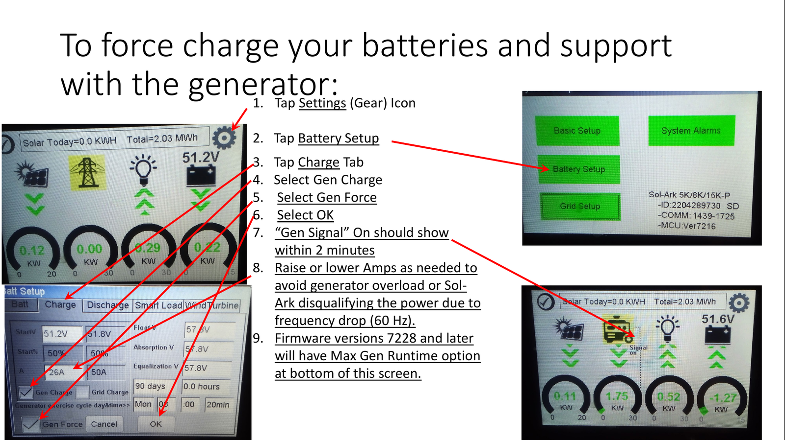
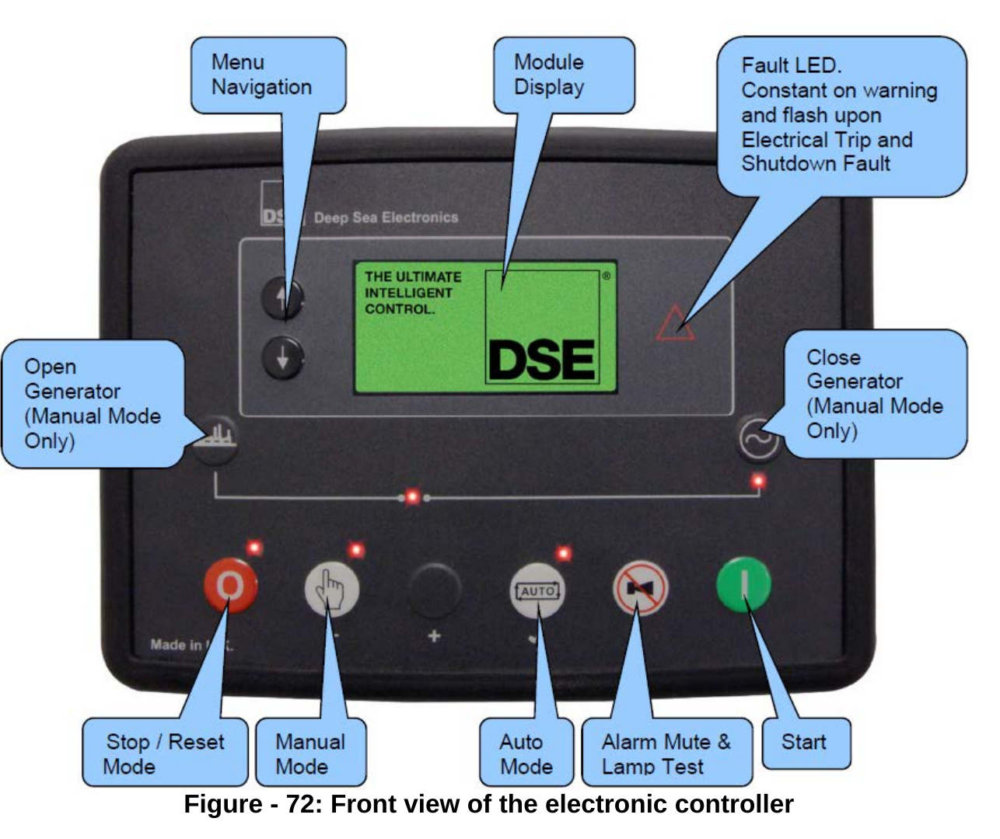

# Runbook — Generator: starting it, charging the batteries, and when it won't run

**Use this page when** the batteries are getting low and you need the generator to run,
when the generator should have started on its own but didn't, when it is running but the
batteries are not filling, or when you need to plug in a portable generator because the
big one is out of action. It also tells you how to stop the generator safely and what to
check on it through the year. You do not need any electrical training to follow the
procedures. The inverters are the two grey Sol-Ark boxes with touch screens; the
generator is the towable diesel set outside.

> **⚠ STOP — read before touching anything**
>
> - **Carbon monoxide kills.** The generator only ever runs outdoors, exhaust pointing away from doors, windows and air intakes. Never run a portable generator in the garage, shop or under a porch — not even with the door open.
> - **Never put the generator's controller in Manual and walk away.** In Manual it will not stop itself. Put it back in **Auto** before you leave.
> - **Never stop the generator while the inverters are still pulling power from it.** Turn charging off on the inverter screen first, wait for "Gen Signal" to go out, then stop the generator.
> - **Do not open the generator enclosure while it could start.** It can start by itself at any moment on a remote signal. Before working inside, press Stop, and have someone unclip the battery cable marked **NEG** or **−** (the one that goes to the engine block or frame; it is usually black) — clips of the Battery Tender off first, then the battery cable.
> - **Only a 240 V generator works on the portable-generator socket, 12 kW or smaller.** A 120 V camping generator does nothing and may be damaged.
> - Do not change any setting not named on this page. If a screen looks different from the picture, stop and call.

## What you see → what to do

| What you see | Go to |
|---|---|
| Batteries are low (under about 35 %) and the generator has not started | **Procedure 1** — make it run now |
| You want to top up the batteries before a storm or a cloudy spell | **Procedure 1** |
| "Gen Signal" shows on the inverter screen but the generator is silent | **Procedure 2** — the generator itself |
| Generator starts, runs a minute or two, then dies or trips its breaker | **Procedure 3** — it is overloaded |
| Generator is running but the battery % is not going up (or only crawling) | **Procedure 3** |
| Generator is running and batteries show 93–95 % — "why hasn't it stopped / why won't it go to 100 %?" | **That is normal.** It stops itself at about 95 %. To stop it sooner, use Procedure 4. |
| You want to stop the generator | **Procedure 4** — stopping safely |
| The big generator is broken and you have a portable 240 V generator | **Procedure 5** — portable generator |
| It is autumn or the first cold night is coming | **Procedure 6** — cold-weather checks |
| Monday morning the generator ran for 20 minutes on its own | **Normal.** That is its weekly self-test. |

## Procedure 1 — Make the generator run and charge the batteries now

Do this on the **master** inverter's touch screen (the left-hand Sol-Ark, or whichever
one is marked MASTER). The MySolArk phone app has the same screens.

*Left: the Charge tab — the two boxes you tick are "Gen Charge" and "Gen Force". Right: the home screen — the words "Gen Signal" appear near the generator symbol once the inverter has called the generator.*

- [ ] **Step 1.** Tap the ⚙ gear icon at the top right of the home screen. You see a menu of big buttons.
- [ ] **Step 2.** Tap **Battery Setup**. Then tap the **Charge** tab across the top. You see a list of boxes with check marks.
- [ ] **Step 3.** Tick **Gen Charge** and tick **Gen Force**. Tap **OK**.
  **If** the screen shows "Grid Charge" ticked as well, leave it ticked — that is normal for the big generator.
- [ ] **Step 4.** Go back to the home screen (tap the back arrow twice). **Within 2 minutes** the words **"Gen Signal"** appear and you hear the generator crank and start.
  **If not within 3 minutes →** go to **Procedure 2**.
- [ ] **Step 5.** Wait **1 to 3 more minutes**. The inverter is checking that the generator's power is steady before it uses it. Then the generator symbol on the screen shows power flowing in, and the battery symbol shows it charging (a negative battery number on SolarAssistant means it is filling).
  **If the generator runs but nothing flows after 5 minutes →** go to **Procedure 3**.
- [ ] **Step 6.** Leave it running. **It stops itself at about 95 %** — it will never show 100 % on generator power, and the last few percent are slow. That is by design.
- [ ] **Step 7. Important:** "Gen Force" keeps the generator running **until you untick it**. When the batteries are where you want them, do **Procedure 4** to stop it properly.

> **⚠ WARNING:** Do not go into the Discharge tab or any other tab to "make it charge more". The only two boxes you need are Gen Charge and Gen Force.

## Procedure 2 — Gen Signal is on but the generator is silent

The inverter has asked; the generator did not answer. The cause is almost always on the
generator, and you can check it yourself.

*The generator's control box (behind the left rear door of the enclosure). Bottom row of five buttons, left to right: **Stop/Reset** (far left, the O symbol), **Manual** (second, the hand symbol), **Auto** (middle, printed AUTO), **Alarm mute / lamp test** (fourth, the bell symbol), **Start** (far right, the | symbol; it is green). A small lamp beside each mode button lights to show which mode is selected. The lamp in the top-right of the controller marked with a ⚠ (fault) lights when there is a fault.*

- [ ] **Step 1.** Go outside to the generator. Open the **left rear door**. Look at the control box. Read any message on its little screen and write it down (for example "Start Failure", "Low Oil Pressure", "Emergency Stop").
- [ ] **Step 2.** Check the **Auto** light is on. **If it is not →** press the **Auto** button once. Its light comes on. Within a couple of minutes the generator cranks and starts. **Done — go back to Procedure 1, Step 5.**
- [ ] **Step 3.** Check the large round **EMERGENCY STOP** mushroom button (the only big push-button on the panel; it is red) on the panel is **pulled out**, not pushed in. **If it was pushed in →** twist and pull it out, then hold the **Stop/Reset** button until the fault message disappears, then press **Auto**.
- [ ] **Step 4.** If the screen says **"Start Failure"**: the engine tried several times and gave up, and it will **not try again until you reset it**. Before resetting, look for the reason:
  - [ ] Fuel gauge — is there diesel?
  - [ ] Is it below freezing and the fuel might have gelled? (see Procedure 6)
  - [ ] The **Battery Tender** clipped to the generator's starting battery — is its lamp **steady**? Compare the lamp against the printed legend on the tender: the tender only distinguishes states by colour (red vs green), so if you cannot tell them apart, treat **any flashing** as "not yet floated" and **no light at all** as a problem. A fast-flashing lamp or no lamp means the starting battery is probably flat or the clips are off.
- [ ] **Step 5.** Once you have fixed what you can (added fuel, etc.): **hold the Stop/Reset button** (far left of the bottom row, the O symbol) until the fault message clears, then press **Auto**. Within 2 minutes the generator starts.
  **If it cranks but still will not start, or you could not find a reason →** stop here and call (see below). Do not keep resetting it.
- [ ] **Step 6.** If the screen shows a different fault — **Low Oil Pressure**, **High Coolant Temperature**, **Over Speed**, **Under Speed** or anything about the alternator voltage or frequency — **do not reset it**. These mean the engine protected itself. Call for help.

> **⚠ WARNING:** Pressing **Manual** then **Start** will run the generator by hand, but in Manual it will **never stop or start by itself**, and the inverters will not get its power until you close the generator breaker. Only use Manual if the installer tells you to, and **always press Auto before you leave**.

## Procedure 3 — Generator runs but dies, trips, or the batteries don't fill

This means you are asking the generator for more than it can give: charging current plus
whatever the house is using.

- [ ] **Step 1.** Turn off big loads for now: water heater, electric heat or air conditioning, well pump if you can, clothes dryer, car charger, welder, shop tools.
- [ ] **Step 2.** If the generator has stopped, go to it. If the screen shows a fault, hold **Stop/Reset** until it clears, press **Auto**. If its main breaker (the big black switch on the panel) has tripped, switch it fully off and back on.
- [ ] **Step 3.** On the master inverter: ⚙ Settings → **Battery Setup** → **Charge** tab. Find the number next to **Gen** in the **A** (amps) column. Write down what it is now.
- [ ] **Step 4.** Lower that number by about a quarter (for example 100 → 75). Tap **OK**. Both inverters use this number, so the real charge rate is double what you type.
- [ ] **Step 5.** Go back to the home screen. Within 1–3 minutes the generator power starts flowing again.
  **If it trips again →** lower the number once more. **If it trips a third time →** untick Gen Force (Procedure 4) and call for help.
- [ ] **Step 6.** If the generator has been running for hours and the battery % barely moved, something is using the power as fast as it comes in. Look at the **Load** figure on the home screen. If it is high, find what is on and turn it off. If Load is low and the battery still isn't rising, call for help.
- [ ] **Step 7.** When things are back to normal, you can put the **Gen A** number back to what you wrote down in Step 3.

> **⚠ WARNING:** Do not raise the Gen A number above what you wrote down in Step 3 to "charge faster". A higher number can overload the generator and trip its breaker under a sudden load.

## Procedure 4 — Stopping the generator safely

Do it in this order. Stopping the generator while the inverters are still drawing from it
can damage the generator's voltage regulator.

- [ ] **Step 1.** On the master inverter: ⚙ Settings → **Battery Setup** → **Charge** tab.
- [ ] **Step 2.** Untick **Gen Force**. (Leave **Gen Charge** and **Grid Charge** ticked — they are what let it auto-start next time.) Tap **OK**.
- [ ] **Step 3.** Go to the home screen. **Wait until "Gen Signal" disappears.** This can take a couple of minutes.
- [ ] **Step 4.** The generator keeps running a few minutes more by itself to cool down, then stops. You do not need to touch it.
  **If it is still running 10 minutes after Gen Signal went out →** go to the generator; check its controller is in **Auto**, not Manual. If it is in Manual, press **Stop**, wait for it to stop, then press **Auto**.

## Procedure 5 — Using a portable 240 V generator instead

For when the big generator is out of action. The outdoor **50 A round socket** on the
wall feeds the inverters through a **different input** from the big generator, so you
have to change two settings on the inverter and change them back afterwards.

> **⚠ WARNING:** **240 V generators only, 12 kW or smaller.** Run it **outdoors**, well away from the house, exhaust pointing away. Never refuel while it is running or hot.

- [ ] **Step 1.** Put the generator outside. Plug the heavy 240 V cord into the **wall socket first**, then into the generator.
- [ ] **Step 2.** Start the generator. Let it warm up for **2–5 minutes** with nothing happening on the inverter yet.
- [ ] **Step 3.** On the master inverter: ⚙ Settings → **Battery Setup** → **Charge** tab.
- [ ] **Step 4.** **Untick Grid Charge.** **Tick Gen Charge.** (The big generator uses the "Grid" setting; the portable uses "Gen".)
- [ ] **Step 5.** Set the **Gen A** number to about **half of what the portable generator can give, split between the two inverters**. Use this table, and write down the old number first:

  | Portable generator size | Type this in Gen A |
  |---|---|
  | 5 kW | 25 |
  | 7–8 kW | 35 |
  | 10 kW | 50 |
  | 12 kW | 60 |

  (Each inverter charges at this many amps, so the real total is double. 20 A on one inverter is about 1 kW.)

- [ ] **Step 6.** Tick **Gen Force**. Tap **OK**. Go to the home screen. "Gen Signal" appears within 2 minutes; power flows after 1–3 minutes more.
- [ ] **Step 7.** Keep house loads to a minimum while it charges. **If the portable generator bogs down or trips →** lower Gen A further.
- [ ] **Step 8. When finished:** untick **Gen Force** and **Gen Charge** → **OK** → wait for "Gen Signal" to go out → stop the portable generator → unplug at the generator, then at the wall.
- [ ] **Step 9. Put it back:** ⚙ Settings → **Battery Setup** → **Charge** tab → **tick Grid Charge** again and type the old Gen A number back in → **OK**. If you skip this, the big generator will not auto-start next time.

## Procedure 6 — Cold-weather and regular checks (you can do these)

The generator is the one part of the system that needs looking after. Do these checks
and it will start when you need it.

**You will need (walk-around and cold-weather checks):** flashlight; clean rags; a small
container (about 1 quart) for the water-separator drain; anti-gel additive for diesel
(any major brand, dose per the bottle); nitrile gloves; the generator's fuel log.

**Every time you are near it (and always before winter):**

- [ ] **The 120 V cord plugged into the generator** (the ordinary household plug on the power-panel door) is **plugged in and live**. It runs the engine heater that keeps the oil warm below freezing, and the built-in battery charger. Without it the generator may not start on a cold morning.
- [ ] **Battery Tender lamp** on the starting battery is **steady** (= battery full and maintained; the legend printed on the tender calls this the float state, shown in green). **Flashing** = still charging — wait and check again later; the tender only tells the states apart by colour (red = charging, green = nearly full), so if you cannot see the difference treat any flashing as "not yet floated". **No light at all = problem** — check the clips and the plug.
- [ ] Fuel level. Enough for a few days of running (it burns about 2–3.6 gallons an hour).
- [ ] Controller in **Auto**, no fault message, emergency stop pulled out.

**Before each fill from October to March (or any fill that might still be in the tank by October):**

> **⚠ WARNING:** Diesel gels in freezing weather and the generator will not start. **Add anti-gel treatment to every fill** heading into winter. Damage from gelled fuel is **not covered by warranty**.

- [ ] Add the anti-gel at the dose on the bottle.
- [ ] Open the drain on the fuel/water separator bowl (under the fuel filter) until clean fuel runs, then close it. Do this more often in winter.

**Each time you walk round it (any day it is going to run):**

- [ ] Look under and around it for fuel, oil or coolant drips.
- [ ] Oil dipstick between the marks; coolant between the marks in the overflow bottle.
- [ ] Air filter's restriction indicator (the small clear window on the air-cleaner housing) has not popped to show its **warning band** (press the button on top to reset it after a filter change).
- [ ] Hoses and belts look intact.

**Once a year, and every second year:** it needs a proper service (oil, filters, belt).
Book the installer or a diesel mechanic — see the Technician appendix (section B) and the
[maintenance calendar](cheatsheet-maintenance-calendar.md). If you are doing it
yourself, the parts and fluids list is in the Technician appendix (section B); buy them before
you start so the generator is never left half-serviced.

## Stop and call for help when…

- The generator shows **Low Oil Pressure**, **High Coolant Temperature**, **Over/Under Speed** or any alternator voltage/frequency fault.
- "Start Failure" comes back after you have reset it once and fixed the obvious things.
- You smell fuel, see smoke from anywhere but the exhaust, or see a leak.
- The generator trips its breaker three times even after lowering Gen A.
- The batteries are below **15 %** and you cannot get the generator to run — the inverters will shut the house down at about 15 %. Turn everything off that you can and call now, not later.
- Any inverter has its indicator labelled **Alarm** lit and the screen shows a code you do not understand.

## Who to call

| Who | For | Contact |
|---|---|---|
| **Installer** — Ernie Williams, Mainstream Green Solutions, Lexington TN | First call for anything on this page | **(731) 697-1665** · Ernie.williams@mainstreamgreensolutions.com · www.mainstreamgreensolutions.com |
| **Sol-Ark Technical Support** | Inverter screens, codes, settings | 7 days a week (not 24 h) — support@sol-ark.com |
| **Pytes** | Battery packs | ess_support@pytesgroup.com |
| **Generator** — Wildcat / Patriot dealer | Engine, controller, service | Number on the generator's nameplate |

---

## Technical detail

The tables, specifications, manual quotations and technician-only procedures that back
this page are in the **Technician appendix, section B** (`cheatsheet-99-technician-appendix`).
You do not need it to follow the steps above.
