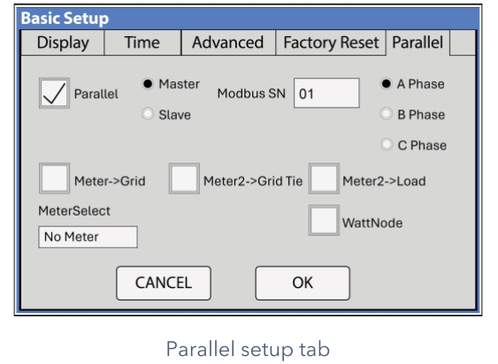

# Runbook — One inverter has failed (the house still has some power)

Use this page when one of the two Sol-Ark inverters in the power room has gone dark, is
has its **Alarm** indicator lit, or SolarAssistant shows one inverter has stopped reporting — and the
other one is still running. It tells you how to find out which unit failed, try one safe
restart, keep the house running on the survivor, and what to do if the failed one is the
**master** (the one in charge). Promoting the other inverter to master is an installer
job; it is written out here so a technician can talk you through it on the phone.

> **⚠ STOP — read before touching anything**
>
> - **Never open an inverter case.** There is nothing inside you can fix, and the
>   capacitors hold a lethal charge after power-off.
> - **The only things you touch** on an inverter are: the breakers, the round **PV
>   disconnect** switch on its side, the **power button**, and the **touchscreen**.
> - **Power-OFF order is master first, then slave. Power-ON order is slave first,
>   master last.** Doing it backwards makes the units fault and can leave the system down.
> - **Batteries before inverters, always.** The battery packs must be on and showing lights
>   before any inverter is switched on.
> - **Never leave two inverters both set to Modbus SN 1.** Two "masters" will fight and
>   neither will work.
> - **Moving wires inside the inverter's comms terminal strip is a technician job.** Do not
>   do it alone unless you have been shown how.

**Words used on this page**

- **Master / slave** — the two inverters work as a team. The **master** (Modbus SN 1) is in
  charge: it talks to the batteries, starts the generator, and copies its settings to the
  **slave** (Modbus SN 2).
- **Modbus SN** — the number (1 or 2) each inverter is given on its Parallel settings page.
- **MPPT** — one of the three solar inputs on each inverter. Each has 14 panels.
- **DIP switch** — a tiny two-position switch inside the comms terminal cover. It marks
  the "ends" of the link cable between inverters. In a two-inverter system **both are ON**
  and should not need touching.
- **Two-wire start** — a pair of small wires from the master inverter (pins 7 & 8) to the
  generator. When the master closes that circuit, the generator starts.

## What you see → what to do

| What you see | Go to |
|---|---|
| One inverter's screen is dark, or its **Alarm** indicator is lit, and the other is running normally | Procedure 1 |
| Both inverters show **F41** on their alarm list and one of them keeps faulting | Procedure 1, then 2 |
| SolarAssistant shows one inverter column frozen / "stale", the house has power | Procedure 1 |
| You did a restart and the same unit faulted again | Procedure 3 |
| The dead inverter is **inverter 1 (the master)** — the generator did not start when the batteries got low, or the survivor shows **F58** / **F46** | Procedure 4, **now** |
| The house went completely dark (both inverters off) | This is not a one-inverter failure. Go to the **Batteries** runbook, "inverter has shut down". |
| Replacement inverter has arrived | Procedure 5 |

## Procedure 1 — Find out which inverter failed and what it says

- [ ] Go to the power room. Look at the four small lights on the front of each inverter:
      **DC**, **AC**, **Normal**, **Alarm**. You should see one unit with the **Normal**
      indicator lit and one with the **Alarm** indicator lit, or nothing lit at all.
- [ ] Write down which unit it is. Inverter 1 is the master; inverter 2 is the slave. (If
      you are unsure, tap ⚙ → **Basic Setup** → **Parallel** tab on a working unit: it
      shows *Master* or *Slave* and its Modbus SN.)
- [ ] On the failed unit, if the screen is alive, tap the home screen → **System Alarms**.
      Write down every code and the time. You should see one or more **F-numbers**.
      **If not →** if the screen is dark, note that; the power cycle in Procedure 2 is still
      the next step.
- [ ] Look at the alarm list on the **working** unit too. You will usually see **F41** there —
      that is the healthy unit reporting that its partner dropped out. **It is not a second
      failure.**
- [ ] Check the network cable between the two inverters (yellow, the only one of its kind on the comms strip) (it runs between the
      **Parallel** ports on the comms strip) is clicked in at both ends. **If the failed
      unit's code is F29 or F46 →** a loose cable is the most likely cause. Re-seat it and
      go to Procedure 2.
- [ ] If the alarm list shows the same code **five or more times** in a row, the inverter has
      **locked itself out** and will not restart on its own. Procedure 2 is still the right
      next step — the power cycle is the manual reset.

Common codes, in plain words:

| Code | What it means |
|---|---|
| F41 | The other inverter stopped. Seen on the healthy unit. Normal. |
| F29 / F46 | Can't talk to the other inverter — cable or address problem. |
| F61 | Someone pressed the slave's power button without turning the master off first. |
| F58 | Can't see the batteries. Expect this on the slave if the **master** has died (the battery cable lands on the master). |

## Procedure 2 — One full restart, in the right order

Most faults clear with one restart. Do this **once**. If the same unit faults again
afterwards, go to Procedure 3 — repeated restarts do not help and can make things worse.

**You will need:** a flashlight, a phone or notepad, about 15 minutes. The house will be
without power for a few minutes in the middle of this.

- [ ] Warn everyone in the house the power is going off for a few minutes.
- [ ] **On the master (inverter 1) first:** switch OFF its three AC breakers — **GRID**,
      **GEN** and **LOAD**. Then turn the round **PV disconnect** switch on its side to OFF.
      Then press its **power button** to OFF. The screen goes dark after a few seconds.
- [ ] **Now the slave (inverter 2):** the same three steps — AC breakers OFF, PV disconnect
      OFF, power button OFF.
- [ ] Switch OFF the battery breakers (order does not matter).
- [ ] **Wait a full minute.** This lets everything discharge.
- [ ] Switch the battery breakers back ON. Walk to the battery rack and confirm **every
      pack shows lights** (the indicator labelled **RUN** blinking slowly, or the **SOC** capacity bar lit).
      **If not →** see the *Batteries* runbook, "power everything up in the right order",
      before going further. Inverters must not come on with the batteries dark.
- [ ] **Slave (inverter 2) first:** power button ON → wait for the screen → PV disconnect ON
      → wait for the **DC** indicator to light → AC breakers ON (GRID, GEN, LOAD).
- [ ] **Master (inverter 1) last:** the same steps.
- [ ] Watch both screens for **up to 3 minutes**. You will probably see **F29** and **F41**
      flash up briefly while they find each other — that is expected. Then the **Normal**
      indicator should light on both units.
- [ ] **If both come up Normal →** done. Check SolarAssistant shows both inverter columns
      updating. Keep an eye on it for a day.
- [ ] **If the same unit faults again →** Procedure 3.

> **⚠ WARNING:** If the unit that failed is the **master** and it does not come back, go
> to **Procedure 4 now** — the generator will not start on its own until this is sorted,
> and the batteries will drain.

## Procedure 3 — Isolate the dead inverter and run the house on the survivor

Goal: the failed unit is switched fully off and left alone; the good unit carries the
house until the installer comes.

**You will need:** a flashlight, a piece of tape and a marker to label the dead unit.

- [ ] On the **failed unit only**: AC breakers OFF (GRID, GEN, LOAD) → PV disconnect OFF →
      power button OFF → its battery breaker OFF. Tape a note on it: "FAILED — DO NOT
      SWITCH ON — date".
- [ ] Leave the inverter-to-inverter link cable (yellow) where it is. In a two-inverter system the survivor is
      already an "end" of the link and its DIP switch stays ON. Nothing to change.
- [ ] Restart the survivor on its own (Procedure 2 steps, but only for that unit) so it
      stops looking for its partner. It may show F29/F41 once; it should then go **Normal**.
      **If not →** call Sol-Ark support with the code.
- [ ] **Shed load.** One inverter alone can supply about **12 kW from the batteries** (15 kW
      when the sun is strong) and **half the usual solar** — the dead unit's 42 panels are
      out of action. In practice: **run one big thing at a time.** Do not run the well pump,
      clothes dryer, electric range/oven, HVAC, water heater and EV charger together. Two of
      those at once is usually fine; four is not.
- [ ] Nothing to change in SolarAssistant. The dead unit's column stays frozen until the
      replacement is wired up; that is expected.
- [ ] Call the installer (see *Who to call*) and give them the codes you wrote down.

Generator charging still works if the **master** is the survivor. The charge current into
the batteries is set per inverter, so with one unit gone the batteries charge at half the
usual rate — that is normal, and the generator run will simply take longer.

## Procedure 4 — If it is the MASTER (inverter 1) that died

This is urgent. The master is the only unit that (a) talks to the battery packs and (b)
can start the generator. With it dead, **the generator will not auto-start and the
batteries can run all the way down** with nothing to stop it. Do not wait until morning.

### Part A — Stopgap: get the generator running by hand (you can do this)

**You will need:** a flashlight, the generator's enclosure key if it is locked.

- [ ] Write down the current battery % from SolarAssistant or the survivor's screen. Below
      about **20 %** you have very little time.
- [ ] Go to the generator. Open the **left rear door**. On the **DSE** controller panel,
      press the **Manual** mode key (second from left on the bottom row; the small
      indicator beside it comes on), then press the **Start** key (far right of the bottom
      row) once. It cranks and should run within a few seconds.
      **If not →** see the *Generator* runbook, "generator won't start".
- [ ] Let it run unloaded for about 3 minutes.
- [ ] Back in the power room, watch the survivor's **AC** indicator. The generator is
      wired into both inverters, so the survivor is being fed as soon as the generator runs.
      **If the AC indicator comes on** within 2–3 minutes, the survivor is taking generator
      power — the house is on generator and the batteries are charging. You have time.
      **If the AC indicator does not come on →** the survivor is refusing the generator without a master
      present. Turn off every big load (see Procedure 3) and go straight to Part B with the
      installer on the phone.
- [ ] Leave the generator running in **Manual** until the installer tells you otherwise.
      It will not stop by itself in Manual — **check the fuel.**

> **⚠ WARNING:** A generator in **Manual** will run until you stop it. Do not leave the
> property with it running unattended for long periods, and do not return it to Auto until
> a working master inverter is in charge again.

### Part B — Make the slave the new master (installer job — do not do this alone)

> **⚠ WARNING: Part B involves moving small wires inside the inverter's comms terminal
> strip and the battery communication cable. Do this only with the installer or Sol-Ark
> support on the phone, or if you have been shown it in person.** Done wrong, the
> batteries and generator stay invisible to the system and the house can lose power.

**You will need:** a small flat screwdriver for the pluggable terminal strip, a flashlight,
the generator off, the phone with the technician on it.

- [ ] Power everything down in the right order (Procedure 2, the OFF half): dead master
      first if it is alive at all, then the slave, then the battery breakers. Wait a minute.
- [ ] **Move the battery communication cable.** It is a network-style cable from the master
      battery pack to the dead master's right-hand RJ45 jack labelled **Battery CANBus**. Unplug
      it there and plug it into the **same jack on inverter 2**. (If each inverter has a
      small splitter on that jack, move only the battery leg.)
- [ ] **Move the generator start wires.** Two thin wires land on pins **7 and 8** of the dead
      master's comms terminal strip. Loosen the screws, move them to pins **7 and 8 on
      inverter 2**, tighten. Polarity does not matter — it is a simple switch contact.
- [ ] **Leave the SolarAssistant cables alone.** They are not affected.
- [ ] Power up the batteries (all packs showing lights), then **inverter 2 only**.
- [ ] On inverter 2's screen: ⚙ → **Basic Setup** → **Parallel** tab. Tap **Master**, set
      **Modbus SN** to **01**, leave *Parallel* ticked, tap **OK**.

      
      *The Parallel tab. Tap "Master" and change Modbus SN to 01. Nothing else on this screen changes.*

- [ ] Power inverter 2 off and on again (power button) so the new role takes effect. Wait
      for the **Normal** indicator to light.
- [ ] With the technician, **check every settings page** on the new master: Grid type
      (120/240 V split-phase), **Battery Setup** (capacity 61.4 kWh, Shutdown 15 %, charge
      amps, "BMS Lithium Batt 00", "Activate Battery" ticked), generator **Start %** (35 %),
      **Max Gen Runtime** (150 min), and — if Time of Use is on — that **Charge** is ticked in
      every time slot. These were copied from the old master, but confirm them.
- [ ] **Prove the generator:** ⚙ → **Battery Setup** → **Charge** tab → tick **Gen Force** → OK.
      Within 2 minutes the home screen shows **Gen Signal** and the generator starts (the
      DSE must be back in **Auto** for this). Then untick **Gen Force**; the generator stops
      after its cool-down.
      **If not →** the start wires are on the wrong pins or the DSE is still in Manual.
- [ ] **Prove the batteries:** ⚙ → **System Setup** → **Li-Batt Info** shows live battery
      voltage, % and current. **If the screen is blank →** the battery cable is not seated
      in the Battery CANBus jack.
- [ ] Shed load as in Procedure 3 until the replacement is installed.

## Procedure 5 — When the replacement inverter arrives

This is the installer's job. What to expect, so you can check it was done:

- [ ] Firmware on the new unit is updated to **match** the existing one before it is
      connected (both must show the same COMM and MCU numbers on System Setup).
- [ ] The new unit is set up on its Parallel tab as the **slave**, Modbus SN **02** (simplest:
      leave the promoted unit as master), or the wiring from Procedure 4 Part B is moved back
      and it becomes master again. **Never both at 01.**
- [ ] Its DIP switch is set ON (two-inverter system: both ON).
- [ ] Full power-up in order: batteries → slave → master. Brief F29/F41, then both Normal.
- [ ] Installer confirms the Grid and Battery settings copied across to the new unit.
- [ ] SolarAssistant's RS485 lead is plugged back into the new unit's Battery CANBus
      splitter; its column starts updating within a few minutes.

## Stop and call for help when…

- The same unit faults again after **one** restart (Procedure 2). Do not keep restarting.
- Any code you see is **not** in the table above, or the screen shows anything about
  **arc fault (F63)**, **over-voltage (F55)**, or **DC insulation (F24)**.
- The **master** has died — call while you do Procedure 4 Part A.
- The survivor will not go **Normal** after being restarted on its own.
- You smell burning, see scorch marks, hear buzzing or crackling from an inverter.
- The battery % is under **20 %** and falling and the generator is not running.

## Who to call

| Who | When | Contact |
|---|---|---|
| Installer — Ernie Williams, Mainstream Green Solutions, Lexington TN | First call for anything on this page; replacement and promotion work | **(731) 697-1665** · Ernie.williams@mainstreamgreensolutions.com · www.mainstreamgreensolutions.com |
| Sol-Ark Technical Support | Fault codes, settings, walking you through the screens | 7 days a week (not 24 h) — support@sol-ark.com |

---

## Technical detail

The tables, specifications, manual quotations and technician-only procedures that back
this page are in the **Technician appendix, section C** (`cheatsheet-99-technician-appendix`).
You do not need it to follow the steps above.
