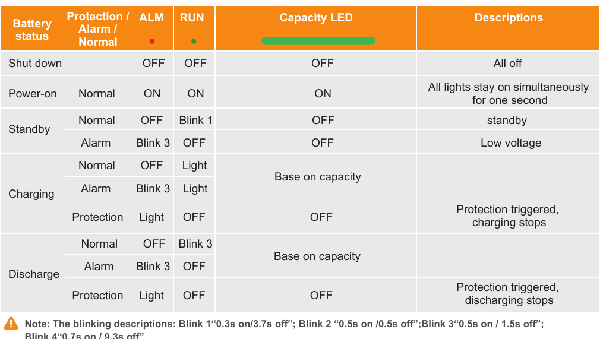
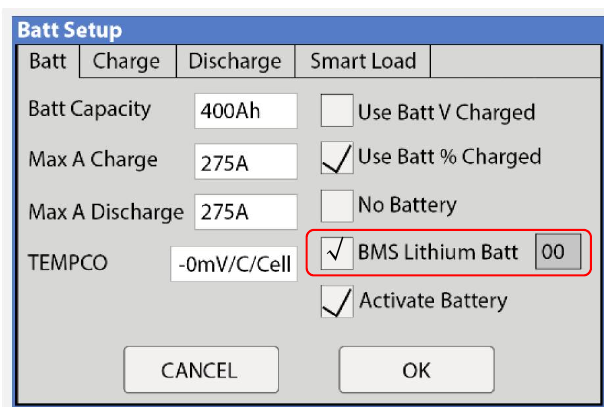
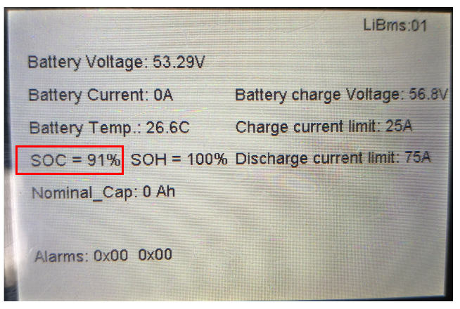

# Runbook — Batteries: low battery, power went out, a battery pack has shut itself off

Use this page when the battery is running low, the house has lost power because the
batteries ran down, the inverter screen is dark, or one of the battery packs has its **ALM** light on steadily or no lights at all. It also tells you how to turn the whole system off and on
again in the right order. You do not need any electrical training to follow it — but you
do need to follow the steps in order and stop where it says to stop.

> **⚠ STOP — read before touching anything**
>
> - **A battery pack that has shut itself off must be charging again within 12 hours.** If it sits flat longer than that, it is damaged and the warranty will not cover it. The moment you find a dead pack, write down the time.
> - **Never open a battery pack.** There is nothing inside for you to fix, and opening it voids the warranty.
> - **Never connect a flat pack directly to the other, live packs** to "jump" it. It can damage both.
> - **Do not press buttons on the packs unless a step on this page tells you to.** The packs are meant to sort themselves out once charge arrives.
> - **Take off rings, watches and metal jewellery** before going near battery terminals, and never lay a metal tool on top of a pack.
> - **Do not reset the inverter or flip battery breakers** to "fix" a shutdown unless a step tells you to. The system is designed to restart itself.

## What you see → what to do

| What you see | What it means | Go to |
|---|---|---|
| The battery symbol on the inverter screen changes from its normal look (it turns yellow), and **Home → System Alarms** lists *Low Batt* | The batteries are getting low. Power is still on. | **Procedure 2** |
| The house has **no power**; the inverter screen is still lit and the battery symbol has changed again (it turns red) | The inverter has switched off to protect the batteries. | **Procedure 3** |
| The inverter screen is **completely dark** and there is no power | Either the batteries are very low, or the inverter has locked itself out. | **Procedure 3** |
| On a battery pack, the light marked **ALM** is on steadily (it is the red one) and every other light is off | That pack has protected itself and stopped. | **Procedure 4** |
| A battery pack has **no lights at all** | That pack is off or completely flat. | **Procedure 4** |
| On a battery pack, the light marked **ALM** is blinking, but power is fine | Usually normal — the pack is near a limit, not broken. | **Procedure 1** |
| SolarAssistant shows one **battery pack missing** from the list | The pack is off, or has stopped talking to the system. | **Procedure 1**, then **4** |
| You need to **turn the whole system off**, or turn it back **on** | — | **Procedure 5** |

A few words you will see on the screens:

- **SOC** — "state of charge": how full the batteries are, as a percentage.
- **BMS** — the small computer inside each battery pack that protects it.
- **Shutdown / Restart** — the battery levels at which the inverter turns the power off (Shutdown) and back on again by itself (Restart). On this system Shutdown is **15 %**.
- **Master pack** — the one battery pack with the communication cable to the inverter.

## Procedure 1 — Read the lights on a battery pack

Each pack has a light marked **ALM** (the red one), a light marked **RUN** (the green
one), and a row of small lights marked **SOC** showing how full it is. **Go by the
printed labels and by whether a light is steady, blinking or off — not by its colour.**

*How to read the lights. Use the **ALM** and **RUN** column headings and the blink patterns — not the lamp colours. "Blink 1" is a short flash every 4 seconds; "Blink 3" is a flash every 2 seconds. The rows you care about most are the two marked "Protection": **ALM** steady on ("Light"), **RUN** off, SOC row off — the pack has stopped.*

- [ ] **Look at the light marked RUN.** Slow flash (once every 4 seconds) = resting. Steady on = charging. Faster flash = supplying power. All of these are normal.
- [ ] **Look at the light marked ALM.** **Off** = fine. **Blinking** = the pack is near one of its limits (low, hot, cold, or heavy load). This is usually normal and needs nothing from you — keep an eye on it.
- [ ] **ALM on steadily, every other light off** = the pack has **protected itself and stopped**. → **Procedure 4**.
- [ ] **No lights at all** = the pack is switched off or completely flat. → **Procedure 4**.
- [ ] **All lights on together for one second** = the pack has just been switched on. That is normal.

**If** a pack's **ALM** light is on steadily **and** the system is charging (sunny day, or the generator is running), give it 10 minutes — **ALM** should go out and **RUN** should come on by itself once charge reaches it. **If not →** Procedure 4.

## Procedure 2 — Battery is low (*Low Batt* shown)

The batteries are getting low but the power is still on. Your job is to make the power
last and make sure the generator is going to start.

- [ ] **Note the time and the battery percentage** (top of the inverter screen, or the SolarAssistant dashboard).
- [ ] **Turn off anything that can wait:** water heating, electric heaters, car charging, the dryer, pumps that are not needed right now. Leave the fridge, freezer and lights.
- [ ] **Check the generator is set to start by itself.** On this system it starts automatically at **35 %**. Walk out to the generator and look at its controller: the **Auto** light should be lit. **If not →** press the **Auto** key (see the Generator runbook, Procedure "Getting the generator back into Auto").
- [ ] **If the batteries are already below 35 % and the generator has not started**, start it yourself now — do not wait for it to happen at 3 a.m. → Generator runbook, Procedure "Force a generator run".
- [ ] **Look for a reason** in SolarAssistant: is solar lower than usual for the weather? Is one inverter column blank? Is something drawing a lot of power that shouldn't be?

> **⚠ WARNING:** Do **not** change any Shutdown, Restart or battery settings on the inverter to "get more out of" the batteries. The only setting an untrained person may change is the generator start percentage, and only as described in the Generator runbook. **Running the batteries below 10 % damages them and is excluded from warranty.**

## Procedure 3 — Power has gone out (battery symbol changed, or dark screen)

The inverter has turned the power off because the batteries reached the Shutdown level.
**It will turn the power back on by itself** once the batteries are charged above the
Restart level. Your job is to get charge into the batteries — not to reset anything.

> **⚠ WARNING:** **Do not press the inverter power button, do not flip the battery breakers, and do not turn the inverter off and on.** The inverter is waiting, not broken. Resetting it throws away the count it keeps and can make things worse.

- [ ] **Is it daylight?** If the sun is up, the solar panels are already charging the batteries even though the house power is off. **Wait.** Power comes back on its own, usually within an hour or two on a decent day.
- [ ] **Is it dark, or heavily overcast?** Start the generator:
  - If the inverter screen is still lit: ⚙ Settings → **Battery Setup** → **Charge** tab → tick **Gen Charge** and **Gen Force** → **OK**. The generator should start within 2 minutes. (Full steps in the Generator runbook.)
  - If the inverter screen is dark: start the generator from its own control panel — press **Manual**, then **Start** (Generator runbook, Procedure "Start the generator by hand"). The generator feeds both inverters.
- [ ] **Watch the inverter screen.** Once the batteries rise above the Restart level, the house power comes back on by itself. You should see the battery symbol return to its normal look and the load numbers reappear.
- [ ] **When power is back, turn things back on a few at a time** — not everything at once.
- [ ] **If the inverter screen is dark and stays dark** even though the generator is running or the sun is out: the inverter may have **locked itself out**. It tries to restart itself up to **5 times** after a low-battery shutdown; after the fifth time it stops trying and waits for a person. Look for the light marked **Alarm** on the inverter's front (it is the red one) being lit. → **Stop and call for help** (below). Tell them "the inverter has locked out after five restarts" and read them the alarm code shown on the screen.
- [ ] **If the generator ran for an hour and the battery percentage has not moved**, one or more packs may have shut themselves off. Walk to the battery rack and read the lights → **Procedure 1**.
- [ ] **Afterwards, find out why it happened.** The usual reasons: the generator was not in Auto; a time-of-use schedule blocked it; a solar string was off; or something ran all night. Write down what you find.

## Procedure 4 — A battery pack has shut itself off (ALM on steadily, or no lights)

A pack in this state has opened its own internal switch to protect itself. It will
**come back by itself** once it sees charge — but it has to see that charge **within 12
hours** or it is damaged for good.

> **⚠ WARNING:** **Start the clock now. Write down the time you found it.** Everything below has to be done before 12 hours are up. If you are not sure you can get charge to the pack in time, call the installer straight away rather than at hour 11.

- [ ] **Get the system charging.** Sun up: the solar is already doing it. Otherwise start the generator (Procedure 3, second step). The whole battery rack needs to be receiving charge for the pack to wake.
- [ ] **Check the inverter is allowed to wake batteries.** On the inverter: ⚙ Settings → **Battery Setup** → **Batt** tab. The box **Activate Battery** must be ticked, and **BMS Lithium Batt** must be ticked with **00** beside it. Look — do not change anything else on this screen.

*The Batt tab. The three ticks to look for: **Use Batt % Charged**, **BMS Lithium Batt** with **00**, and **Activate Battery**. The numbers on the left are an example, not this site's.*

- [ ] **Check the inverter can see the batteries.** ⚙ Settings → **System Setup** → **Li-Batt Info**. You should see a screen like the one below with a battery voltage, a percentage and "Alarms: 0x00".

*What a healthy battery link looks like. If this screen is blank or shows no numbers, the inverter cannot talk to the batteries — call for help.*

- [ ] **Make sure the pack is switched on.** On the front of the dead pack: the **POWER** switch should be in the **ON** position. If it is OFF, switch it ON. Then press and hold the small **SW** button for **one second** and let go. All the lights should come on together for a second. After that the light marked **RUN** should come on steady (charging). **If not →** next step.
- [ ] **Give it time.** With charge flowing, the pack may take 10–30 minutes to wake. Check the lights again. **ALM** out and **RUN** on = it is back. Carry on charging until the whole system reads at least 50 %.
- [ ] **If the pack will not wake** after an hour of the rest of the system charging, it is too flat for the inverter to reach. The only way to recover it is to charge it **on its own** with a **51.2 V LFP "force charger"** — a special charger connected straight to that one pack. **If you do not have one, or have not been shown how to use it, stop here and call the installer.** Do not connect the pack to anything else and do not try a car charger.

> **⚠ WARNING:** A force charge is a **technician's job** unless you have been trained on it. Doing it wrong can damage the pack or start a fire. **Never connect a flat pack directly to the other live packs.**

- [ ] **If the pack is still dark, or ALM stays on steadily after it has been charged**, it needs service. → **Stop and call for help.** Do not keep trying.

## Procedure 5 — Turn the whole system off, or on, in the right order

Only do this if the installer or support has asked you to, or if you need to shut down
for safety (flood, fire, smell of burning). The order matters: **batteries on before the
inverters, inverters off before the batteries.** Doing it the other way round can damage
the packs.

**To turn everything OFF:**

- [ ] **Turn off the inverters first.** On each inverter: turn off the LOAD, GRID and GEN breakers, turn the round PV disconnect switch on the side to OFF, then press the inverter's power button to OFF. Do the **master** inverter first, then the other.
- [ ] **Now the batteries.** Press and hold the **SW** button on the **master pack** (the one with the communication cable) for **three seconds**. The lights on all the packs go out one after another.
- [ ] **Wait until every pack's lights are out**, then move each pack's **POWER** switch to OFF.
- [ ] Turn off the battery breakers (if fitted).

**To turn everything ON:**

- [ ] Turn on the battery breakers (if fitted).
- [ ] Move every pack's **POWER** switch to ON.
- [ ] Press the **SW** button on the **master pack** only, for **one second**. Wait until **every** pack shows lights.
- [ ] **Only now** turn the inverters on — the **other** inverter first, the **master** inverter last: power button ON, then the PV disconnect, then the GRID/GEN/LOAD breakers. Wait for the light marked **Normal** to come on on each.

> **⚠ WARNING:** **Never turn an inverter on while the battery packs are still dark.** The inverter draws a big surge the instant it connects, and a pack that is not ready can be damaged by it.

## Stop and call for help when…

- A pack has been dark, or has had **ALM** on steadily, for more than **6 hours** and you cannot get charge to it — do not wait until the 12 hours are nearly up.
- The inverter screen is dark and the light marked **Alarm** on its front is lit, or you suspect it has locked out after five restarts.
- The **Li-Batt Info** screen is blank or shows no battery numbers.
- A pack's **ALM** light stays on steadily **after** it has been charged and switched on again.
- You would need to use a force charger and have not been trained on it.
- Anything smells hot, is discoloured, or is making a noise it did not make before. **If you see smoke, get everyone out and call 911 first.**

## Who to call

| Who | For what | Contact |
|---|---|---|
| **Installer — Ernie Williams, Mainstream Green Solutions**, Lexington TN | First call for anything on this page | **(731) 697-1665** · Ernie.williams@mainstreamgreensolutions.com · www.mainstreamgreensolutions.com |
| **Sol-Ark Technical Support** | Inverter alarms, lockouts, settings | 7 days a week (not 24 hours) — support@sol-ark.com |
| **Pytes (battery maker)** | A pack that will not recover | ess_support@pytesgroup.com |

When you call, have ready: which pack lights (ALM / RUN / SOC) are on, blinking or off, the battery
percentage, any alarm code on the inverter screen, and the time you first noticed the
problem.

---

## Reference — for the technician

Sources: Sol-Ark *15K Installation Manual* MA-00007 Rev. 13 (§3.4 Battery Setup, §8.1
Error Codes), the *Pytes V5 User Manual* (§1 specifications, §5.4 start/shut down, §7
troubleshooting), the *Pytes Sol-Ark Guide for V5*, and the installer's customer-training
deck. For an LFP bank (Pytes V5) on parallel Sol-Ark 15K-2P inverters.

### The one rule that voids the warranty

> *"The battery should be charged within 12 hours when it's fully discharged or
> over-discharging protection mode is activated. Fail to follow this instruction will
> damage the battery and is not covered by warranty."* — Pytes V5 manual, §Safety

### Two safeties, in the order they trip

| Layer | What it does | Where set |
|---|---|---|
| **1. Sol-Ark `Shutdown` V/%** | Inverter stops AC output *"to protect the battery from an over discharge situation"*; battery icon turns red. Output resumes at **`Restart` V/%**. If grid or generator is available the inverter passes it through instead. | Battery Setup → Discharge |
| **2. BMS under-voltage protection** | The pack itself stops discharging (ALM **steady red**, other LEDs off). Pytes V5 enters this **below ~5 %** (installer) but keeps a reserve so it can be charged back. Per the manual, protection **releases automatically** once charge is applied — but only if that happens **within 12 hours**. | Fixed in the BMS; pack range 47.5–57.6 V |

Layer 1 is meant to fire first and leave headroom above layer 2. Between them sits
**`Low Batt`** (icon turns yellow): on an off-grid site TOU may discharge down to
*Shutdown*, on a grid-tied site only down to *Low Batt* (§4). The goal is never to reach
layer 2.

Self-clearing alarms (overload, under-voltage, low battery) auto-restart **up to 5
times**; after the fifth stop on the same alarm the inverter **locks out until manually
reset** and the cause is fixed (installer deck). **F56** DC_VoltLow_Fault: *"Batteries are
overly discharged, the inverter is Off-Grid and exceeded the programmed batt discharge
current by 20 %, or Lithium BMS has shut down."* F56 together with **F58** (BMS comms lost)
means the BMS has likely opened its contactor.

The Pytes manual is explicit that a blinking or even steady ALM *"does not necessarily
indicate a faulty battery"*, and that protection *"will resume normal operation
automatically once the 'protection' status is released."* On a pack whose LEDs do not
respond to POWER + SW: *"charge the battery correctly… if the battery enters into charging
mode, it should return to its normal state after completing the charging process."* *"Do
not repair the battery if no authorization from Pytes!"*

### Recommended usable window (training deck)

- LFP: use down to **10–20 % SOC** in normal operation (80–90 % usable). The battery warranty excludes **routine discharge below 10 %**.
- Installer's off-grid setpoints: generator auto-start **35 %**, Sol-Ark Shutdown **15 %** (Sol-Ark's own default is 20 %), emergency floor **11 %**.
- During an outage the bank may go lower before Shutdown — acceptable occasionally, not routinely.
- Bring the bank to **100 % SOC at least once a week** for BMS balancing. Off-grid, that means a clear day with solar — the generator stops at ~95 % and will not do it.
- After any event that let the bank reach BMS protection, review whether the Sol-Ark `Shutdown` setpoint should be raised.

### Setpoints to verify (Battery Setup → Discharge)

| Setting | Purpose | Sanity check |
|---|---|---|
| `Shutdown` % | Inverter stops output | Comfortably above the BMS protection point (~5 % on Pytes) — 15 % is the installer's value |
| `Restart` % | Output resumes | 5–10 points above Shutdown so it does not cycle |
| `Low Batt` % | Yellow warning; TOU floor on grid-tied | Between Shutdown and your normal daily floor |
| `Start %` (Gen Charge) | Generator auto-start | Above Low Batt, well above Shutdown — 35 % leaves ~20 points of reserve |
| Max Gen Runtime | Ends a run by time | Long enough to reach ~90 % from Start % at the set Amps |
| `BMS_Err_Stop` | Stop on loss of BMS comms | Know what it is set to — it decides what slaves do if the master (and its CAN cable) fails |
| Capacity (Ah/kWh) | Used for % SOC and limits | Matches the installed bank |
| Charge Efficiency / Batt Empty V | SOC calculation | Leave at manufacturer values; do not tune |
| `Use Batt % Charged`, `BMS Lithium Batt = 00`, `☑ Activate Battery` | Closed-loop Pytes comms | All three required by Pytes's Sol-Ark guide; Sol-Ark manual: Activate Battery *"MUST be selected … especially Lithium batteries."* A stale or missing battery display on the Sol-Ark means one is off or the CAN cable is out |
| Charge / discharge A (inverter side) | Per-pack limit × packs | Pytes V5: **75 A recommended, 100 A max** continuous per pack; derated outside 10–40 °C cell temperature; **no charging below 0 °C** |

### Pytes V5 pack facts

51.2 V nominal, 100 Ah, **5.12 kWh** per pack; operating range 47.5–57.6 V. Charge 0–45 °C,
discharge −10–50 °C. Cycle life ≥6000 at 90 % DOD; calendar life ≥10 years.
Self-discharge 1–2 %/month. Master pack carries the DIP-switch address and the CAN cable
to the Sol-Ark (standard Ethernet cable; Sol-Ark *Battery CANBus* jack).

*Pytes Sol-Ark guide, Figures 2.1.1.3 and 2.1.1.4.*

**Bank power-up order (manual §5.4) — batteries before inverter, always**, to protect the
packs from the inverters' capacitor inrush: DC breakers on (if fitted) → all POWER buttons
ON → press the **master** pack's SW for 1 s → wait for every pack to show lights → only
then power the inverters (slaves first, master last). **Shut down:** hold the master SW
**3 s** → wait for all pack lights to go out → POWER buttons off → breakers off.

**Force charge (last resort):** isolate the pack (POWER off, breaker off if fitted) and
charge it alone at the terminals with a **51.2 V LFP force charger** until it wakes and
shows RUN steady, then return it to the bank. Never parallel a flat pack into live packs.
The installer's advice: own that charger before it is needed.

**Storage / long idle:** keep packs at 40–60 % SOC; if idle more than 6 months, charge to
>90 % every 6 months. A pack found at zero after storage: *"do not charge or use it
without permission, contact your installer."*

Set a SolarAssistant or Home Assistant alert a few points above `Low Batt` so the first
warning is a notification, not a yellow icon nobody is looking at.
