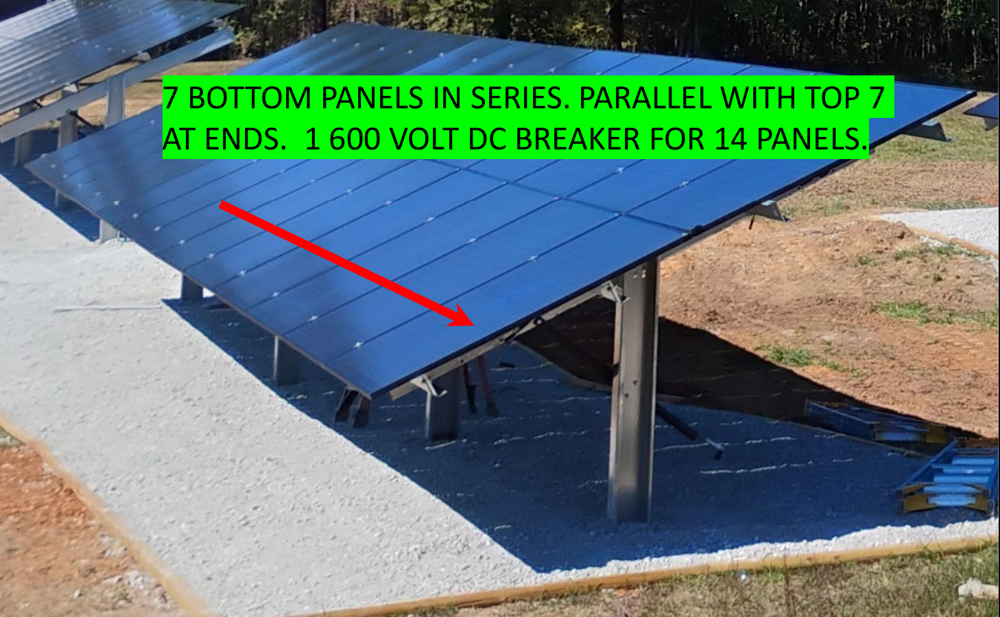
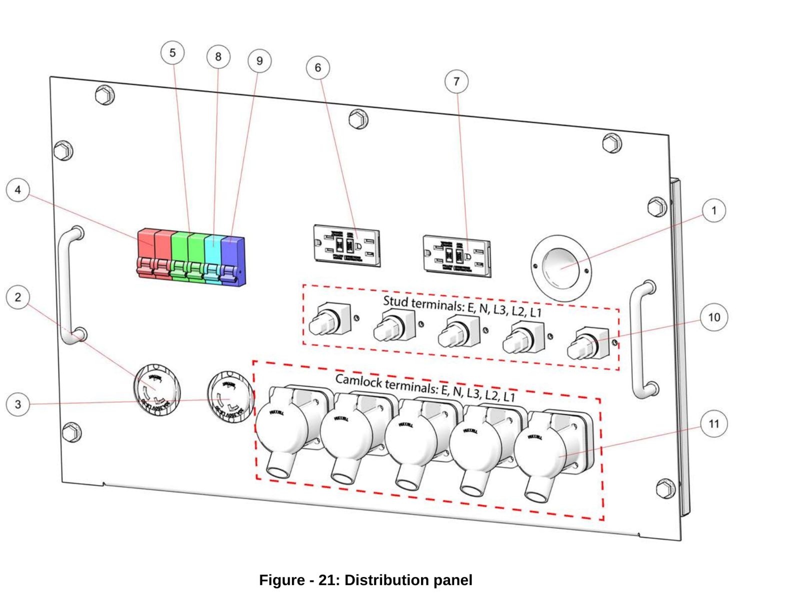

# Runbook — Maintenance calendar: what to do each month, and what to have on hand

Use this page to plan the year. It lists what needs doing and when, for the solar
panels, the batteries and the generator, with the tools and parts each job needs. Most
jobs are on the other runbooks — this page tells you *when* and points you there. The
two big visits are **early April** (summer tilt, panel wash) and **early October**
(winter tilt, generator ready for cold weather). The generator runs few hours a year, so
its service is done **on the calendar**, not on the hour meter.

> **⚠ STOP — read before touching anything**
>
> - **The generator can start by itself at any time** when its controller is in Auto.
>   Before putting hands inside its enclosure, disconnect the generator battery's
>   negative (−) cable, and untick **Gen Force** on the inverter if it is on.
> - **The solar panels are live whenever there is light on them — including
>   moonlight.** Breakers only stop power past the breaker.
> - **Never open an inverter or a battery pack.** You only use breakers, switches,
>   buttons and the screen.
> - **Hot engine parts and hot exhaust.** Let the generator cool before any service.
> - If a job on this page is not on one of the other runbooks and you have not been
>   shown it, **call the installer** rather than guess.

## At a glance

| Month | What to do |
|---|---|
| January | Cold-start watch; clear fresh snow; check last month's generator hours and fuel |
| February | Routine only; check fuel level |
| March | Order spring supplies; check combiner boxes and wall disconnect after winter |
| **April** | **Summer tilt (≈15°) + update SolarAssistant; wash panels; full inspection** |
| **May** | **Generator annual service; generator load test; mow under the array** |
| June | Inverter/battery room ventilation; check the battery packs match each other |
| July | Plan anti-gel; vegetation check |
| August | Firmware check; test the alerts |
| **September** | **Generator pre-winter check; order oil and filters for next May** |
| **October** | **Winter tilt (≈55°) + update SolarAssistant; by 15 Oct confirm the generator's 120 V plug is in and live; controller in Auto** |
| November | First cold-night start check; drain water separator; snow kit out |
| December | Fuel and anti-gel confirmed; review battery setpoints; log the year |

## Every day, week, and run — not tied to a month

| Every | Do this | You will need |
|---|---|---|
| **Day** (or each visit) | Open SolarAssistant. Every inverter column is live, the battery % makes sense, the solar curve matches the weather. Glance at the **Battery Tender** light on the generator battery: it should be **steady, not flashing** — check it against the legend printed on the unit (steady = maintained, the colour is only a hint). | Phone or laptop |
| **Monday 08:00** | The inverter runs the generator for 20 minutes on its own. Check it happened (generator energy shows on that day's chart). **If not →** is the generator controller in Auto? Is there a fault on its screen? See the Generator runbook. | — |
| **Week** | The battery bank reaches **100 %** at least once. It needs a sunny day — the generator stops at 95 %. If it has not hit 100 % in a week, cut the evening loads on the next clear day. | — |
| **Before every generator run you start yourself** | Walk around it: fuel, oil or coolant leaks; oil level; coolant level; air-cleaner restriction indicator not popped up (the window shows clear, not the "service" band); **drain the fuel/water separator**; hoses and clamps look right. | Flashlight, rags, small container for the water-separator drain |
| **After every generator run** | Look at the controller screen for fault messages. Write the hour-meter reading in the log. Confirm the controller is back in **Auto**. | Log book (the Patriot manual's Table 38), pen |
| **Every diesel fill** from October to March — or any fill that might still be in the tank by October | Add **anti-gel** per the bottle's dose for the gallons added. | Diesel anti-gel additive (part: see Patriot manual / dealer) |
| **Every time the racking moves** | Update **Tilt** in SolarAssistant and re-torque the clamps. See the Solar panels runbook, Procedure 3. | Torque wrench (20 ft-lb), phone/laptop |

## Month by month

### January

- [ ] After each cold-morning generator start, look at the controller screen. **You should see** no *Start Failure*. **If you do →** Generator runbook.
- [ ] Check the sump heater plug and the Battery Tender are both still powered (Tender light on and steady, per the legend on the unit).
- [ ] Fresh snow: broom or leaf blower before it refreezes overnight. Ice: leave it. *(Solar panels runbook, Procedure 2.)* **You will need:** soft broom or leaf blower.
- [ ] Compare December's generator hours and fuel used with what you expected.
- [ ] On a clear day, check the forecast line and the actual solar line sit close together in SolarAssistant.

### February

- [ ] Routine items only.
- [ ] Check the diesel level. Winter runs burn 2 to 3.6 gallons an hour.

### March

- [ ] Order what April and May need (see *Stock to keep on the shelf* below): Dawn, spare MC4 connectors, oil, filters, anti-gel.
- [ ] Open each combiner box cover and look at the breakers and inside the box. **You should see** both breakers ON, no water, no chewed wires. Check the wall disconnect handle is ON. **You will need:** flashlight.

### April — spring changeover

- [ ] **Early April: change the racking to the summer tilt (about 15°)** and **update Tilt in SolarAssistant.** *(Solar panels runbook, Procedure 3.)* **You will need:** Sinclair adjustment hardware and instructions, socket/wrench set, torque wrench at 20 ft-lb, a helper, phone or laptop.
- [ ] **Wash the panels** the same visit — early morning or evening. *(Procedure 1.)* **You will need:** garden hose and nozzle, 3–5 gal bucket, Dawn 1–1.5 cups, warm water, squeegee on a 6–8 ft+ pole.
- [ ] **Walk-around inspection** of glass, clamps, cables, boxes, ground wire, and anything growing that will shade the array. *(Procedure 7.)* **You will need:** flashlight, phone for photos.
- [ ] Over the next two or three sunny days, check the forecast matches the actual solar curve.

*What you are walking around in April. Each mount has an upper and a lower row of 7 panels.*

### May

- [ ] **Generator annual service** (the Patriot manual's "every 250 hours or 1 year" items — done yearly here because the hours never get there). Do it in spring so the generator is fresh for winter. *If you have not been shown this, have the dealer or a diesel mechanic do it; the list is for them too.*
  - Change the **engine oil and oil filter**
  - Replace the **primary and secondary fuel filters**
  - Check and adjust the **fan belt**
  - Clean the **centrifugal oil filter**
  - Check and clean the **radiator fins**
  - Write it in the log (Table 38)

  **You will need:** engine oil — the 40 kW HDI DM03PG engine holds **2.5 gal / 9.7 L**, grade per the Patriot manual; oil filter; primary and secondary fuel filters (part: see Patriot manual parts list / dealer); drain pan of at least 3 gal; funnel; rags; socket set and filter wrench; gloves; a sealed container to take the old oil for recycling.

- [ ] **Every second year, add the "500 hours or 2 years" items:** air-cleaner element, replace the belt, check hoses and clamps and replace any that are soft or cracked, valve clearance, fasteners, engine mounts, starter, charging alternator, water pump, thermostat. **You will need:** air-cleaner element, fan belt (part: see Patriot manual parts list / dealer); the rest is inspection and is dealer/mechanic work.
- [ ] **Load-test the generator.** From the inverter: ⚙ Settings → Battery Setup → Charge tab → tick **Gen Charge** and **Gen Force** → OK. **You should see** *Gen Signal* within 2 minutes, the generator start, and after 1–3 minutes the batteries charging. Let it run 30 minutes with normal house loads on. Then untick Gen Force, wait for Gen Signal to drop, and confirm the generator controller shows **Auto**. *(Generator runbook.)*
- [ ] **Mow and clear under the array.** The back of the panels makes power from light off the ground. **You will need:** mower or trimmer.

*Patriot O&M manual, Table 37. Tick marks show which column each job falls in.*

### June

- [ ] Check the room or enclosure where the inverters and batteries live: vents clear, any fans turning, nothing stacked against them. The inverters slow themselves down when they get hot. **You will need:** flashlight, soft brush or vacuum for dust on vents.
- [ ] In SolarAssistant, look at the battery pack cards. **You should see** all twelve packs within about 0.1 V and a few degrees of each other. **If one is drifting →** note which and call the installer.

### July

- [ ] If the diesel in the tank will still be there in October, plan to add anti-gel at the next fill.
- [ ] Walk the array for anything growing up around or under it.

### August

- [ ] Firmware check: ask the installer or Sol-Ark whether an inverter update is due. **Both inverters must be updated together, never one alone.** Also check for SolarAssistant and Pytes updates.
- [ ] Test that the low-battery alert still reaches your phone (trigger a test from SolarAssistant or Home Assistant).

### September — generator pre-winter check

- [ ] Generator **starting battery**: have it load-tested, or replace it if it is more than 4 years old. **You will need:** a 12 V battery load tester or a visit from the dealer; replacement battery per the Patriot manual.
- [ ] Coolant strength checked for the coldest weather you get. **You will need:** antifreeze tester; coolant per the Patriot manual.
- [ ] Anti-gel added to the tank if not already done.
- [ ] **Order for next May:** oil, oil filter, primary and secondary fuel filters, and (every second year) air-cleaner element and belt.
- [ ] Look over the generator's 120 V power cord and plug, the outlet it plugs into, and the Battery Tender's clips and lead. **You should see** no cracked insulation, no corrosion on the clips.

### October — winter changeover

- [ ] **Early October: change the racking to the winter tilt (about 55°, or as steep as the mounts go)** and **update Tilt in SolarAssistant.** *(Solar panels runbook, Procedure 3.)* **You will need:** same as April.
- [ ] **☐ By 15 October — confirm the generator's 120 V plug (the NEMA 5-15 cord on the power-panel door) is plugged in and the outlet is live.** This powers the engine's sump heater — without it the generator may not start below freezing — and the built-in battery charger.
  **How to check, any one of these:**
  - Plug a **plug-in outlet tester** into that outlet. **You should see** the "correct" light pattern.
  - After the first cold night, put a hand on the engine's oil pan (sump). **It should feel warm.**
  - The Battery Tender light on the generator battery is **on and steady, not flashing** — compare with the legend printed on the unit (the tender shares a circuit with the inlet on most setups — if the tender is dark, the circuit is dead).
  - If none of these is possible, ask an electrician to confirm the outlet and that it stays powered when the batteries are low.
  **You will need:** plug-in outlet tester.

  
  *Patriot O&M manual, Figure 21. The 120 V inlet is item **1**, the round socket at the top right of the panel door. Items 2–3 and 6–7 are the generator's output receptacles — not what you are checking.*
- [ ] Battery Tender light: on and steady (per the legend printed on the unit).
- [ ] Generator controller shows **Auto**, no fault on the screen, the large mushroom-head E-stop button on the control panel door is pulled out (released).
- [ ] If last winter's generator runs were too long or too short, adjust the start % or the max run time. *(Generator runbook.)*
- [ ] Over the next two or three sunny days, check the forecast matches the actual solar curve at the new tilt.

### November

- [ ] First night below freezing: next morning, put a hand on the generator's oil pan — **it should be warm**. Confirm the first cold auto-start worked (no *Start Failure* on the controller).
- [ ] Drain the fuel/water separator — temperature swings make condensation. **You will need:** small container, rags.
- [ ] Snow kit where you can reach it: soft broom or leaf blower.

### December

- [ ] Diesel level and anti-gel confirmed before any long cold spell.
- [ ] Look at the battery setpoints with the installer if needed: shutdown %, restart %, generator start % — do they still suit the winter deficit? Low-battery alert tested.
- [ ] Year-end: write down generator hours and fuel used. Decide whether next May is the yearly service or the every-second-year one.

## Every two years and longer

| When | What | You will need |
|---|---|---|
| Every year (250 h column) | Generator: oil + oil filter, fuel filters, belt adjust, centrifugal filter | See May |
| Every 2 years (500 h column) | Generator: air-cleaner element, belt replacement, hoses, valve clearance, mounts, starter, charging alternator, water pump, thermostat | Air-cleaner element, belt; dealer/mechanic for the rest |
| Every 3–5 years | Generator starting battery | 12 V battery per the Patriot manual |
| 10 years | Pytes battery and Sol-Ark warranties end; plan a capacity review | Installer |
| 25 years | Panel power warranty (at least 80 % of rated) | — |

## Stock to keep on the shelf

Only items the source documents call for. Keep them where the generator and the
inverters are, labelled.

| Item | Quantity | Used for |
|---|---|---|
| Engine oil, grade per the Patriot manual | 3 gal (one change is 2.5 gal / 9.7 L) | May service |
| Oil filter | 1 (part: see Patriot manual parts list / dealer) | May service |
| Primary fuel filter | 1 spare (part: see Patriot manual / dealer) | May service; emergency if fuel gels |
| Secondary fuel filter | 1 spare (part: see Patriot manual / dealer) | May service; emergency if fuel gels |
| Air-cleaner element | 1 (part: see Patriot manual / dealer) | Every second May |
| Fan belt | 1 (part: see Patriot manual / dealer) | Every second May; breakdown spare |
| Diesel anti-gel additive | Enough for a full tank (115 gal) | Every fill Oct–Mar |
| Coolant per the Patriot manual | 1 gal | Top-ups |
| Drain pan (3 gal+), funnel, rags, filter wrench | 1 set | Generator service |
| Plug-in outlet tester | 1 | October check of the generator's 120 V outlet |
| Genuine MC4 connectors (Stäubli), male and female | 2 pairs | Solar cable repair |
| MC4 disconnect tool | 1 | Panel replacement |
| Dawn dishwashing liquid | 1 bottle | April wash |
| Window squeegee on 6–8 ft+ pole | 1 | April wash |
| Soft broom or leaf blower | 1 | Snow |
| Torque wrench reading 20 ft-lb, socket set | 1 | Tilt changes, panel clamps |
| **51.2 V LFP force charger** | 1 | Waking a battery pack that has shut itself off — the installer's advice is to own this before it is needed (see the Batteries runbook) |
| Log book (Table 38 in the Patriot manual, or a notebook) | 1 | Every generator run |

## Stop and call for help when…

- The Monday generator exercise did not run and you cannot see why.
- A generator fault will not clear, or *Start Failure* shows twice.
- A battery pack reads differently from the others in June's check.
- The October outlet check fails — the generator's 120 V outlet is dead.
- Any service item above says "dealer/mechanic" and you have not been shown it.

## Who to call

| Who | Contact |
|---|---|
| Installer — Ernie Williams, Mainstream Green Solutions, Lexington TN | (731) 697-1665 · Ernie.williams@mainstreamgreensolutions.com · www.mainstreamgreensolutions.com |
| Sol-Ark Technical Support (inverters) | 7 days a week, not 24 h — support@sol-ark.com |
| Generator service | Wildcat / Patriot dealer — number on the generator's nameplate |

## Technical detail

The tables, specifications, manual quotations and technician-only procedures that back
this page are in the **Technician appendix, section E** (`cheatsheet-99-technician-appendix`).
You do not need it to follow the steps above.
