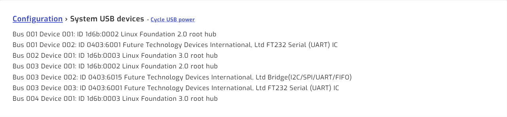
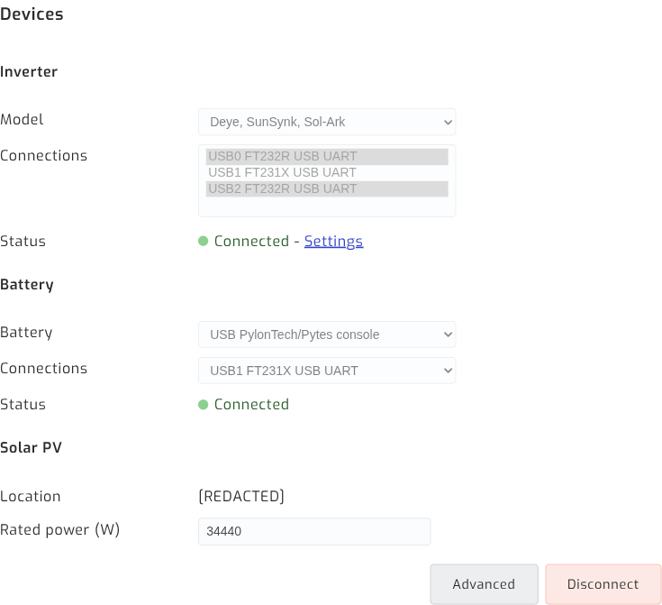
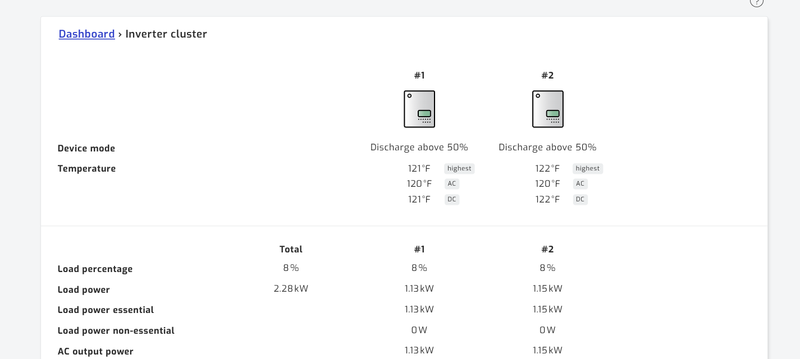
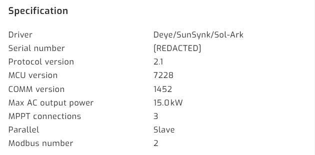
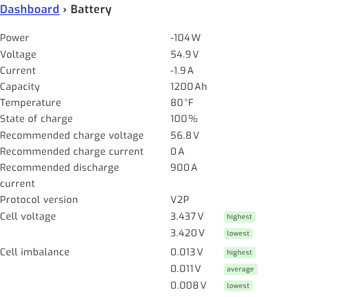
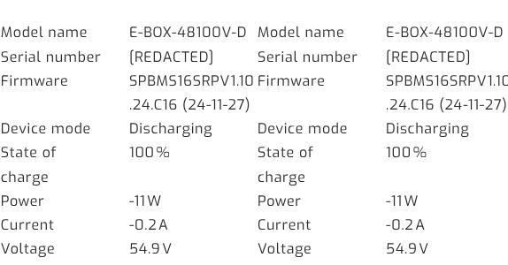

<!-- _class: lead -->

# SolarAssistant Install Walkthrough

## Parallel Sol-Ark 15K inverters + Pytes V5 battery stack

Wiring, ordering, configuration, and verification

<br>

Companion deck to the written guide — see `README.md`

---

## What we're building

SolarAssistant reads **every inverter individually** and **every battery pack**, from one Raspberry Pi.

| Source | What you get |
|--------|--------------|
| Each inverter | Load, PV per MPPT, battery, grid, temps, serial, parallel role |
| Inverter cluster | Site totals across all units |
| Each battery pack | Serial, firmware, SOC, cell voltages, imbalance, cycles |
| Battery bank | Total capacity, SOC, charge/discharge limits |

<div class="note">

This adds monitoring to an already-commissioned system. It is **not** a commissioning procedure for the inverters or the battery.

</div>

---

## The core problem: one port, two buses

The Sol-Ark's **2-in-1 BMS port** is a single RJ45 carrying two independent buses:

| Pin | Signal | Bus | Used by |
|-----|--------|-----|---------|
| 1 | RS485 **B** | RS485 | SolarAssistant |
| 2 | RS485 **A** | RS485 | SolarAssistant |
| 3 | GND | RS485 | SolarAssistant |
| 4 | CAN High | CAN | Inverter → battery BMS |
| 5 | CAN Low | CAN | Inverter → battery BMS |
| 6–8 | unused | — | — |

RS485 needs 3 pins, CAN needs 2 — both fit one connector. **Only one plug fits the socket.** Hence the splitter.

---

## The two scaling rules

<div class="warn">

**Inverters do NOT share a cable.** Each Sol-Ark needs its own RS485 cable into its own USB port. The parallel CAN link between inverters carries no SolarAssistant data.

</div>

<div class="note">

**Battery packs DO share a cable.** One console cable reads an entire stack — two packs or twelve. The master aggregates them.

</div>

Everything about the parts list follows from this asymmetry.

---

## Topology

```
          ┌─────────────────────────────┐
          │   SolarAssistant (Pi 5)     │
          │   4 x USB ports             │
          └──┬───────┬───────┬──────────┘
             │       │       │
          RS485   RS485   RS232 console
             │       │       │
      ┌──────┴──┐ ┌──┴──────┐│
      │ Sol-Ark │ │ Sol-Ark ││
      │   #1    │ │   #N    ││
      │ splitter│ │ splitter││
      └────┬────┘ └────┬────┘│
           │  CAN      │ CAN │
           └─────┬─────┘     │
                 ▼           ▼
          ┌──────────────────────────┐
          │  Pytes V5 stack          │
          │  master + chained packs  │
          └──────────────────────────┘
```

Each inverter = one RS485 leg. Each stack = one console leg. CAN never reaches the Pi.

---

<!-- _class: lead -->

# Ordering

What to buy, and how many

---

## Purchase rules

| Scope | Item | Qty | Unit |
|-------|------|-----|------|
| **Per site** | Device with software (Pi 5) | 1 | $229 |
| **Per Sol-Ark 15K** | RJ45 splitter | 1 each | $14 |
| **Per Sol-Ark 15K** | Sol-Ark RS485 USB cable | 1 each | $29 |
| **Per Pytes V5 stack** | Pytes console USB cable | 1 each | $29 |

```
Total = $229 + ($43 × inverters) + ($29 × stacks)
```

| Site | Total | | Site | Total |
|------|-------|---|------|-------|
| 1 inverter, 1 stack | **$301** | | 3 inverters, 1 stack | **$387** |
| 2 inverters, 1 stack | **$344** | | 4 inverters, 1 stack | **$430** |

All order links: [solar-assistant.io/shop](https://solar-assistant.io/shop)

---

## The USB port budget

<div class="warn">

**More than 3 inverters on a site requires a separate powered USB hub.**

</div>

```
USB ports required = inverters + battery stacks
```

The supplied Pi 5 has **four** USB ports.

| Site | Ports | Fits? |
|------|-------|-------|
| 2 inverters, 1 stack | 3 | Yes, 1 spare |
| 3 inverters, 1 stack | 4 | Yes, none spare |
| 4 inverters, 1 stack | 5 | **No — powered hub** |
| 3 inverters, 2 stacks | 5 | **No — powered hub** |

The hub must be **powered**. Bus-powered hubs cause intermittent FTDI dropouts.

---

## Don't substitute the cables

<div class="warn">

A generic USB-RS485 RJ45 cable **will most likely not work.** Pin assignment inside the RJ45 shell is not standardised — a cable wired for another inverter family puts RS485 A/B on the wrong pins.

</div>

The supplied cables are 1.5 m, shielded, genuine FTDI.

- Counterfeit FTDI chips fail *intermittently*, not cleanly — far harder to diagnose
- The splitter is **not** a passive Y-adapter (more on this shortly)
- Measure the RS485 run **from the splitter**, not the inverter port
- Need more than 1.5 m? Order a custom length — every coupler is a fault candidate

---

<!-- _class: lead -->

# Wiring the inverters

Repeat once per Sol-Ark

---

## Before you open anything

<div class="warn">

The RS485 port is behind the wiring compartment cover, alongside conductors at **battery and AC potential**.

Shut down the inverter. Open the DC and AC disconnects. Confirm de-energised before removing the cover.

Follow Sol-Ark's own shutdown sequence for your model and firmware.

</div>

A comms cable is not worth working a live 15 kW enclosure.

---

## Four RJ45 jacks — three are wrong

| Silkscreen | × | What it is |
|------------|---|------------|
| `Parallel` | 2 | Inverter-to-inverter link — leave alone |
| `Modbus RS485` | 1 | External meters. **Not this one** |
| **`Battery CANBus`** | 1 | **The 2-in-1 port — use this**, right-hand jack |

<div class="warn">

**`Modbus RS485` is a decoy.** You are running an RS485 cable and there is a jack labelled
`Modbus RS485`. It is the wrong one. SolarAssistant reads the inverter over the RS485 pins
of the **`Battery CANBus`** jack.

</div>

---

## Step 1 — Confirm the CAN pins are in use

On each inverter's display, check the battery protocol:

```
Battery type      : Lithium
Lithium protocol  : CAN (protocol 0)
```

- **CAN (protocol 0)** → battery uses pins 4–5, RS485 free. **You need the splitter.** This is the normal Sol-Ark + Pytes case.
- **An RS485 battery protocol** → pins 1–3 already occupied. This approach does not apply.

Check **every** inverter, not just the master — a swapped or re-flashed unit may not match its siblings.

---

## Step 2 — Fit the splitter

```
  Inverter BMS port          ┌──────────┐
   (pins 1-5 in) ────────────│ splitter │
                             └──┬────┬──┘
                          pins  │    │  pins
                           1-3  │    │  4-5
                         RS485  │    │  CAN
                                │    └──► MASTER: cable to battery BMS
                                │         SLAVE:  empty
                                └──► new USB-RS485 cable to the Pi
```

**Only the master's CAN leg is used.** Slaves get battery state over the parallel link, so
a slave's jack is empty to begin with. Fit the splitter anyway — identical wiring
everywhere, and RS485 can never share a socket with CAN.

<div class="warn">

**Never use a passive Y-splitter.** It passes all 8 pins to both sockets, putting RS485 on the battery leg — which breaks SolarAssistant's ability to read the inverter.

</div>

---

## Steps 3 & 4 — Cable and label

**Step 3 — One cable per inverter.** Plug the Sol-Ark RS485 cable into the splitter's RS485 socket, run it to the Pi, own USB port. Never bridge two inverters onto one adapter.

The inverter-to-inverter parallel CAN link is separate — **leave it alone.**

**Step 4 — Label both ends by serial number**, not "1" and "2":

| Cable label (serial) | Parallel role | Modbus № | Pi USB port |
|----------------------|---------------|----------|-------------|
| _serial of inverter A_ | Master / Slave | | |
| _serial of inverter B_ | Master / Slave | | |

Serial is the only key that stays stable across re-seated cables.

---

## Step 5 — Restore power

Close up, restore AC and DC, bring the inverters up.

<div class="note">

Confirm the parallel group still reports **exactly one master** on the inverters' own displays **before** moving to SolarAssistant.

</div>

If the parallel link was disturbed while the cover was off, you want to know now — not while debugging comms.

---

<!-- _class: lead -->

# Wiring the battery

One cable, one port, every pack

---

## Pytes V5 — the easy half

Plug the **Pytes console USB cable** into the master pack's **RS232C / console** port. That's it.

- One cable reads the **entire stack** — 2 packs or 12
- The master is the pack at the head of the chain, address set by DIP switches
- Read the legend on *your* pack revision — Pytes has shipped several
- On a commissioned bank, addressing is already correct: **verify, don't adjust**

<div class="warn">

Don't confuse the console port with the adjacent RS485/CAN sockets — same physical connector. Wrong socket damages nothing; the battery just reports disconnected.

</div>

---

## Three separate battery comms paths

| Path | Carries | Endpoint |
|------|---------|----------|
| Inter-pack chain | Pack-to-pack aggregation | Between the packs |
| CAN to inverters | SOC, charge/discharge limits | Sol-Ark BMS pins 4–5 |
| **RS232C console** | **Full per-pack telemetry** | **SolarAssistant USB** |

The console cable is **additive** — the CAN link to the inverters stays exactly where it is.

---

<!-- _class: lead -->

# Configuration

Two drivers, N ports

---

## Step 1 — Confirm the adapters enumerated

**Configuration → System → USB devices → view detail**



| USB ID | Part | Count |
|--------|------|-------|
| `0403:6001` | FT232 Serial (UART) | one per **inverter** |
| `0403:6015` | Bridge (I2C/SPI/UART/FIFO) | one per **battery stack** |

Missing cable here = physical problem. Stop and fix it — no configuration will help.

---

## Step 2 — Unlock, then set the drivers

The Devices form is **read-only while connected** — press **Disconnect** first.

<div class="warn">

On a running site, Disconnect stops data collection. Do it in a maintenance window, not while chasing a live fault.

</div>

| Device | Model / Driver | Connections |
|--------|----------------|-------------|
| Inverter | `Deye, SunSynk, Sol-Ark` | **one entry per inverter** |
| Battery | `USB PylonTech/Pytes console` | the FT231X console adapter |

---

## The step people miss



Inverter **Connections is a multi-select list** — not a single-choice dropdown.

Highlight **one entry per inverter**. Two Sol-Arks → two highlighted.

Here **USB0 and USB2** are both selected; USB1 is the battery.

<div class="warn">

Select too few and SolarAssistant silently monitors only some inverters. The dashboard still looks plausible because it shows **totals**. Nothing warns you.

</div>

---

<!-- _class: lead -->

# Verification

"Connected" is a weak signal

---

## Why "Connected" isn't enough

The status goes green when **any** selected port opens.

It does **not** prove:

- every inverter is being polled
- every pack is enumerating

Four checks follow. Work through all of them.

---

## Check 1 — One column per inverter



Page is titled **Inverter cluster**, with a numbered column per unit beside Total. **Count the columns against the inverters on site.**

---

## Check 2 — Values independent and plausible


Load **1.13 vs 1.15 kW**. PV **1.19 vs 1.20 kW** — closely matched but **not identical**. That divergence is the proof of independent live reads; byte-identical columns are suspicious.

---

## Check 3 — Serials all distinct


Same serial in two columns = **one inverter read twice** — a cable is in the wrong inverter's splitter.

Each Sol-Ark 15K should also report **3 MPPTs** and **15.0 kW** max AC output.

---

## Check 3 — Exactly one Master



Switch inverters with the breadcrumb dropdown. Each must load its own Specification block.

Check per unit: driver, unique serial, unique Modbus number, and `Lithium protocol: CAN (protocol 0)`.

<div class="warn">

**Exactly one unit must report Master.** Two masters, or none, is a parallel fault on the inverters themselves.

</div>

---

## The numbering gotcha

<div class="warn">

SolarAssistant numbers inverters by **USB enumeration order** — not by Modbus address, not by parallel role.

</div>

On the reference site:

| SolarAssistant name | Parallel role | Modbus № |
|---------------------|---------------|----------|
| Inverter **1** | Slave | 2 |
| Inverter **2** | **Master** | 1 |

Its "Inverter 1" is the Sol-Ark *slave*. **Match on serial number** — the only unambiguous key.

---

## Check 4 — Every pack enumerates



| Signal | Expected |
|--------|----------|
| Capacity | packs × per-pack Ah |
| Pack cards | one per pack |
| Protocol | reported (e.g. `V2P`) |
| Serials | all distinct |
| Firmware | uniform |

**Capacity is the fastest tell** — twelve 100 Ah packs must sum to 1200 Ah.

---

## All packs, one cable



Each pack reports its own model, serial, and firmware — all read through the **single console cable** on the master.

Firmware should be uniform across a stack.

---

## Record a baseline

Once verified good, write these down and keep them with the install:

- Every inverter serial, parallel role, Modbus number
- Pack count, total capacity, every pack serial
- USB IDs and counts from the System page
- Typical cell imbalance range at 100% SOC

<div class="note">

Most future comms faults show up as a **change** from baseline, not an outright failure. Without a baseline, the change is invisible.

</div>

---

<!-- _class: lead -->

# Troubleshooting

---

## Symptom → cause

| Symptom | Likely cause |
|---------|--------------|
| Fewer columns than inverters | Not every USB port selected |
| Two columns, identical serials | Both cables on the same inverter |
| Inverter Disconnected | Wrong pins/port, or non-Deye cable |
| Inverter fine, **battery** drops out | Passive Y-splitter passing RS485 to battery |
| Battery Disconnected | Console cable in RS485/CAN socket |
| Packs missing / capacity low | Duplicate addresses or broken chain |
| Adapter vanished from `lsusb` | Cable, port, or power — try **Cycle USB power** |
| Intermittent dropouts, no clean failure | Counterfeit FTDI, marginal run, or unpowered hub |

---

## Diagnostic order

Work outward from the host — each step rules out everything before it:

1. **USB devices page** — right count, all FTDI. Try **Cycle USB power**.
2. **Devices panel** — correct drivers, correct port count, Connected.
3. **`/inverter/status`** — one column per inverter, distinct serials.
4. **`/battery/status`** — full pack count, expected capacity.

<div class="note">

SSH is disabled by default — there's no shell fallback. All diagnostics run from the web UI.

</div>

---

## The failure to watch for

<div class="warn">

Someone replaces the purpose-built splitter with a **generic RJ45 Y-adapter**. They look interchangeable and the generic one is cheaper and easier to source locally.

</div>

A passive Y-adapter passes all 8 pins to both sockets → RS485 lands on the battery leg.

**The symptom is confusing:** the inverter still reads fine, the battery intermittently drops, and nothing looks wrong at the connector.

If battery comms degrade after any maintenance visit — **check what's physically plugged into the BMS port first.**

---

## Not faults

| Observation | Why it's fine |
|-------------|---------------|
| SolarAssistant "Inverter 1" is the parallel slave | Numbering follows USB enumeration order |
| Grid reads 0 W, 0 Hz, ~0 V | **Normal on an off-grid site** — the grid input is simply absent |
| Small differences between inverters | **Desirable** — proof of independent reads |

<div class="note">

On an off-grid installation, grid-absent is the **expected steady state**, not an alarm. Don't treat it as a fault, and don't let it mask a real comms problem elsewhere.

</div>

---

<!-- _class: lead -->

# After the install

## Three optional improvements

None of these is required — the install is complete without them

---

## What, where, and what it costs

| Change | Page | Disconnect? |
|--------|------|-------------|
| MQTT + Home Assistant | `Configuration → MQTT` | No |
| Battery capacity fallback | `Configuration → Advanced` | **Yes** |
| PV forecast inputs | `Configuration → Advanced` | **Yes** |

The Advanced page is **read-only while connected** and greys out every field. Disconnecting stops data collection.

<div class="note">

**Batch the two Advanced changes into one maintenance window** — same page, one collection gap instead of two. Verify the install first; re-verify after.

</div>

---

## 1. MQTT + Home Assistant discovery

The biggest gain if you run Home Assistant. The broker ships **disabled**; auto-discovery publishes every metric — per inverter, per pack — as HA entities automatically.

| Field | Set to |
|-------|--------|
| Topic prefix | leave at default |
| Allow setting changes | **Disabled** |
| HomeAssistant → Unique ID | short, stable site slug |
| HomeAssistant → Auto discovery | **Enabled** |
| Username / Password | set both |

Then **`Configuration` → MQTT Broker → Start.** The MQTT page configures the broker; it does not start it.

---

## MQTT — two things to get right

<div class="warn">

**`Allow setting changes` grants write control over your inverters.** Enabled, anything that can publish can change work mode, charge currents, generator control. Leave it Disabled unless you intend to automate — and never expose the broker beyond the LAN.

</div>

<div class="warn">

**`Unique ID` is effectively permanent.** Changing it later re-creates every entity under new IDs, orphaning HA history and dashboards. Set it before first connection, even on a single site.

</div>

Port 1883 is plaintext, no TLS. **Check first:** SolarAssistant runs its *own* broker — if HA already uses Mosquitto, confirm your HA version supports more than one.

---

## 2. Battery capacity fallback

`Configuration → Advanced → Battery → Capacity kWh`

Commonly holds a **single-pack** figure — wrong by the pack count in a multi-pack bank.

```
Capacity kWh  = packs × per-pack kWh
per-pack kWh  = nominal pack voltage × pack Ah ÷ 1000
```

Only used when capacity **isn't readable** from battery or inverter — so it's dormant on a healthy install, and goes live exactly when comms drop. A full bank can then read as nearly empty, while you're already troubleshooting.

<div class="note">

**Risk: none.** Display fallback only — charge control comes from the inverter settings and the BMS over CAN.

</div>

---

## 3. PV forecast inputs

`Configuration → Advanced → Solar PV` — decoration on a grid-tied site, **operational off-grid**: it's the input to "run the generator tonight?"

| Field | Source |
|-------|--------|
| Latitude / Longitude | Site coordinates |
| Tilt | Racking angle, or roof pitch |
| Azimuth | Array bearing |
| Temp. coefficient, NMOT | Module datasheet |
| Rated power *(Configuration page)* | **DC nameplate sum** of panels |

**Azimuth `0` = due south**, `−90` east, `90` west, `180`/`−180` north. A stored `0` is legitimate, not a placeholder.

<div class="warn">

**Don't reuse a compass bearing.** pvlib, PVWatts and Home Assistant put `0` at **north**. Applying one here points a south-facing array due north.

</div>

---

## PV forecast — validate, don't guess

Compare predicted vs actual over two or three clear-sky days:

| Symptom | Likely culprit |
|---------|----------------|
| Over/under-predicts by a fixed ratio | Rated power |
| Peak arrives earlier or later | Azimuth |
| Accurate in one season, poor in the other | Tilt |
| Drifts high in afternoon heat | Temperature coefficient |

<div class="warn">

**Multi-orientation arrays:** only one tilt and one azimuth are accepted. Enter the **average** facing direction, weighted by rated power if the split is uneven, and accept an imperfect curve.

</div>

---

## Leave these alone

Look adjustable; already correct on a working install.

| Setting | Correct | Why |
|---------|---------|-----|
| Battery → Read current from | `Battery` | `Inverter` is for banks where **only the master** is readable |
| Inverter → MPPT connections | `Auto detect` | Correctly finds the actual count |
| Grid connection / multiplier | `Auto detect` | |
| Allow passive reading | `Yes` | Harmless on a dedicated RS485 line |
| Grid → Provider | `Default` | Tariff data — irrelevant off-grid |

---

## Sol-Ark ↔ SolarAssistant

You will have **both apps open** while commissioning. The labels rarely match:

| MySolArk | SolarAssistant |
|----------|----------------|
| **Limited power to Load** | **Zero export to load** |
| **Grid Start %** | **Start grid charge capacity** |
| Grid Start A | Max grid charge current |
| Batt Shutdown / Low / Restart % | Output shutdown / Stop / Start discharge |
| BMS Lithium Batt Mode | Lithium protocol — `0` is CAN |
| SmartLoad Setup | Auxiliary → Aux port |
| Equipment mode / Modbus SN | Parallel role / Modbus № |

Full table: **page 09**. Labels drift between app versions; the registers don't.

---

## Terminology — where it bites

<div class="warn">

**Generator on the grid input?** `Grid Start %` and `Grid Start A` are the real trigger and
current limit. The generator settings are **inert** — throttling a generator with a *gen*
charge-current limit does nothing.

</div>

<div class="warn">

**There is no `Grid Stop %`** — charging ends on current taper (~5% of rated capacity,
≈95% SOC), not an SOC setpoint. An alert waiting for 100% on generator power never fires.

</div>

<div class="warn">

**Time Of Use vs Use timer** — these can disagree. MySolArk is authoritative for its own
hardware; believe it over SolarAssistant's checkbox.

</div>

---

<!-- _class: lead -->

# Reference

## Order pages

**Device (per site)** — `solar-assistant.io/shop/products/device_rpi5`

**RJ45 splitter (per inverter)** — `.../products/deye_rj45_split`

**Sol-Ark RS485 cable (per inverter)** — `.../products/sunsynk_rs485`

**Pytes console cable (per stack)** — `.../products/pytes_rs232`

<br>

Full written guide: `README.md` — pages 00 through 09
